# CI/CD Setup Summary

## What Was Set Up

Your library is now configured with a complete CI/CD pipeline for automated testing and npm publishing.

## Files Created

### GitHub Actions Workflows

1. **`.github/workflows/ci.yml`** - Continuous Integration
   - Runs on all PRs and pushes to main/develop
   - Multi-job workflow with quality checks, tests, builds
   - Tests on Node.js 18, 20, and 22
   - Codecov integration for coverage

2. **`.github/workflows/publish.yml`** - Automated Publishing
   - Triggers on version tags (vX.Y.Z format)
   - Comprehensive pre-publish verification
   - Publishes to npm with provenance
   - Creates GitHub releases automatically

3. **`.github/workflows/release.yml`** - Manual Release Creation
   - Workflow dispatch for easy version bumping
   - Handles version updates and tag creation
   - Triggers automated publish workflow

### Configuration Files

4. **`package.json`** - Updated with:
   - `publishConfig` for public npm access
   - `bugs` and `homepage` URLs
   - `author` field

5. **`.npmignore`** - Enhanced to exclude:
   - Source files (TypeScript)
   - Development files
   - Test files
   - Examples and documentation
   - Build artifacts

### Documentation

6. **`PUBLISHING.md`** - Complete publishing guide
   - Step-by-step release process
   - Troubleshooting common issues
   - Security best practices

7. **`CHANGELOG.md`** - Version history
   - Initial 0.1.0 release documented
   - Unreleased section for upcoming changes

8. **`.github/SETUP.md`** - CI/CD setup instructions
   - Prerequisites and configuration
   - Testing procedures
   - Troubleshooting guide

9. **`README.md`** - Updated with badges:
   - npm version
   - CI status
   - Code coverage
   - License

## How It Works

### For Development (PRs and Pushes)

```mermaid
graph LR
    A[Push Code] --> B[CI Workflow]
    B --> C[Quality Checks]
    B --> D[Tests Node 18/20/22]
    B --> E[Build]
    B --> F[Storybook]
    C --> G{All Pass?}
    D --> G
    E --> G
    F --> G
    G -->|Yes| H[✓ Ready to Merge]
    G -->|No| I[✗ Fix Issues]
```



### For Publishing (Version Tags)

```mermaid
graph LR
    A[Create Tag] --> B[Publish Workflow]
    B --> C[Verify Tag]
    B --> D[Quality Checks]
    B --> E[Tests]
    B --> F[Build]
    C --> G{All Pass?}
    D --> G
    E --> G
    F --> G
    G -->|Yes| H[Publish to npm]
    G -->|No| I[✗ Fail Workflow]
    H --> J[Create GitHub Release]
```



## Quick Start Guide

### Prerequisites Setup

1. **Create npm Automation Token**

   ```
   1. Go to https://www.npmjs.com/settings/[username]/tokens
   2. Click "Generate New Token" → "Automation"
   3. Copy the token
   ```

2. **Add Token to GitHub**

   ```
   1. Go to repository Settings → Secrets → Actions
   2. Click "New repository secret"
   3. Name: NPM_TOKEN
   4. Paste token value
   5. Click "Add secret"
   ```

3. **(Optional) Add Codecov Token**
   ```
   1. Go to https://codecov.io
   2. Find your repository
   3. Copy upload token
   4. Add to GitHub secrets as CODECOV_TOKEN
   ```

### Making Your First Release

#### Option 1: Using release-it (Easiest)

```bash
# Dry run to see what happens
pnpm release -- --dry-run

# Create the release
pnpm release
```

This will:

- Run all checks
- Update package.json version
- Create git commit and tag
- Push to GitHub
- Trigger automated npm publish

#### Option 2: Manual Tag

```bash
# Ensure package.json has correct version
# Commit any changes

# Create and push tag
git tag v0.1.0
git push origin main
git push origin v0.1.0
```

#### Option 3: GitHub UI

```
1. Go to Actions tab
2. Click "Create Release" workflow
3. Click "Run workflow"
4. Enter version (e.g., 0.2.0)
5. Click "Run workflow"
```

## Workflow Features

### CI Workflow (`ci.yml`)

**Triggers:**

- Push to `main` or `develop`
- Pull requests to `main` or `develop`

**Jobs:**

- **Quality Checks**: spell check, ESLint, TypeScript
- **Tests**: Run on Node 18, 20, 22 (parallel)
- **Build**: Compile and verify artifacts
- **Storybook**: Build documentation site

**Artifacts Uploaded:**

- Build artifacts (7 days)
- Storybook static site (7 days)

### Publish Workflow (`publish.yml`)

**Triggers:**

- Tags matching `v*.*.*` (e.g., v0.1.0, v1.2.3-beta.1)

**Security Features:**

- npm provenance (supply chain security)
- OIDC authentication
- Version verification
- Pre-publish validation

**Outputs:**

- Published npm package
- GitHub release
- Release notes

### Release Workflow (`release.yml`)

**Triggers:**

- Manual workflow dispatch

**Inputs:**

- Version number (e.g., 0.2.0)
- Pre-release flag (boolean)

**Actions:**

- Updates package.json
- Creates git commit and tag
- Triggers publish workflow

## Version Numbering

Follow Semantic Versioning (SemVer):

- **Patch**: Bug fixes (0.1.0 → 0.1.1)
- **Minor**: New features (0.1.0 → 0.2.0)
- **Major**: Breaking changes (0.1.0 → 1.0.0)
- **Pre-release**: Beta/alpha (0.1.0 → 0.2.0-beta.1)

## What Gets Published

The npm package includes:

- `dist/` - Compiled JavaScript and type definitions
- `README.md` - Documentation
- `LICENSE` - MIT license
- `package.json` - Package metadata

It excludes:

- Source TypeScript files
- Tests
- Examples
- Development configs
- Git files

Verify with:

```bash
npm pack --dry-run
```

## Security Features

1. **npm Provenance**
   - Cryptographic proof of origin
   - Links package to source commit
   - Verifiable on npm

2. **Secrets Management**
   - NPM_TOKEN stored securely in GitHub
   - Never exposed in logs
   - Rotation recommended every 6 months

3. **Branch Protection** (Recommended)
   - Require status checks before merge
   - Require review for PRs
   - Protect main branch

## Monitoring

### Check CI Status

```
https://github.com/luminastudy/blocks-graph/actions
```

### Check npm Package

```bash
npm view @luminastudy/blocks-graph
```

### Check Coverage

```
https://codecov.io/gh/luminastudy/blocks-graph
```

## Common Commands

```bash
# Local development
pnpm install          # Install dependencies
pnpm storybook        # Start dev server
pnpm test             # Run tests
pnpm build            # Build library

# Quality checks
pnpm typecheck        # Type checking
pnpm lint             # Linting
pnpm lint:fix         # Auto-fix linting
pnpm spell:check      # Spell check

# Publishing
pnpm release          # Automated release
pnpm release -- minor # Release minor version
pnpm release -- major # Release major version
```

## Next Steps

1. **Test CI Pipeline**
   - Create a test PR
   - Watch workflows run
   - Verify all checks pass

2. **Configure Branch Protection**
   - Go to Settings → Branches
   - Add rule for `main`
   - Require status checks

3. **First Release**
   - Update CHANGELOG.md
   - Run `pnpm release -- --dry-run`
   - Run `pnpm release`

4. **Monitor First Publish**
   - Watch publish workflow
   - Verify on npm
   - Test installation

## Troubleshooting

See detailed troubleshooting in:

- `PUBLISHING.md` - Publishing issues
- `.github/SETUP.md` - Setup issues

Common issues:

- **403 Forbidden**: Check NPM_TOKEN is valid
- **Version mismatch**: Tag must match package.json
- **Build fails**: Run `pnpm build` locally first
- **Tests fail**: Check Node version, clear cache

## Resources

- [GitHub Actions Docs](https://docs.github.com/en/actions)
- [npm Publishing](https://docs.npmjs.com/cli/v10/commands/npm-publish)
- [Semantic Versioning](https://semver.org/)
- [npm Provenance](https://docs.npmjs.com/generating-provenance-statements)

## Support

For issues:

1. Check workflow logs in GitHub Actions
2. Review documentation (PUBLISHING.md, SETUP.md)
3. Open an issue on GitHub

---

**Your library is now ready for automated publishing! 🚀**
