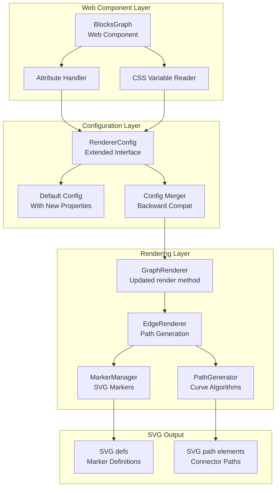
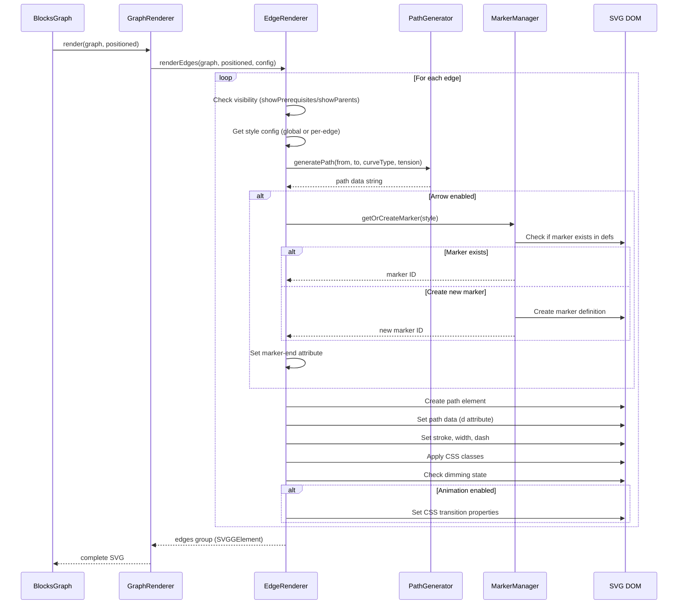
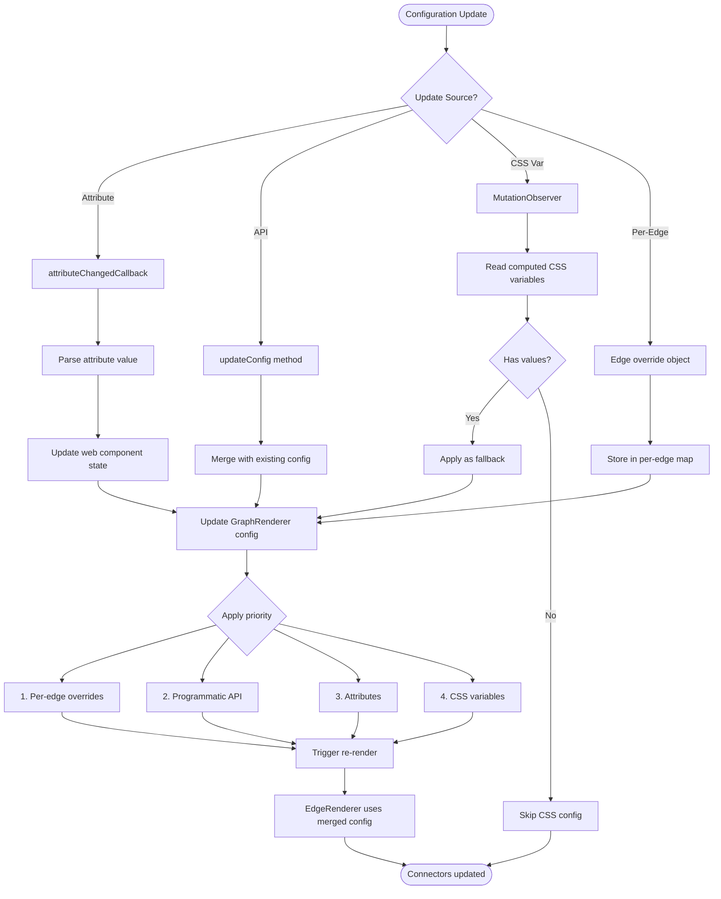
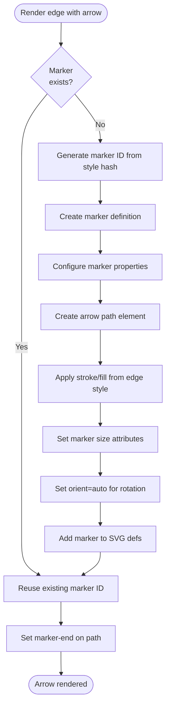
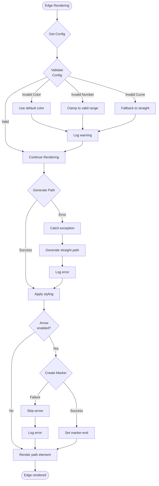
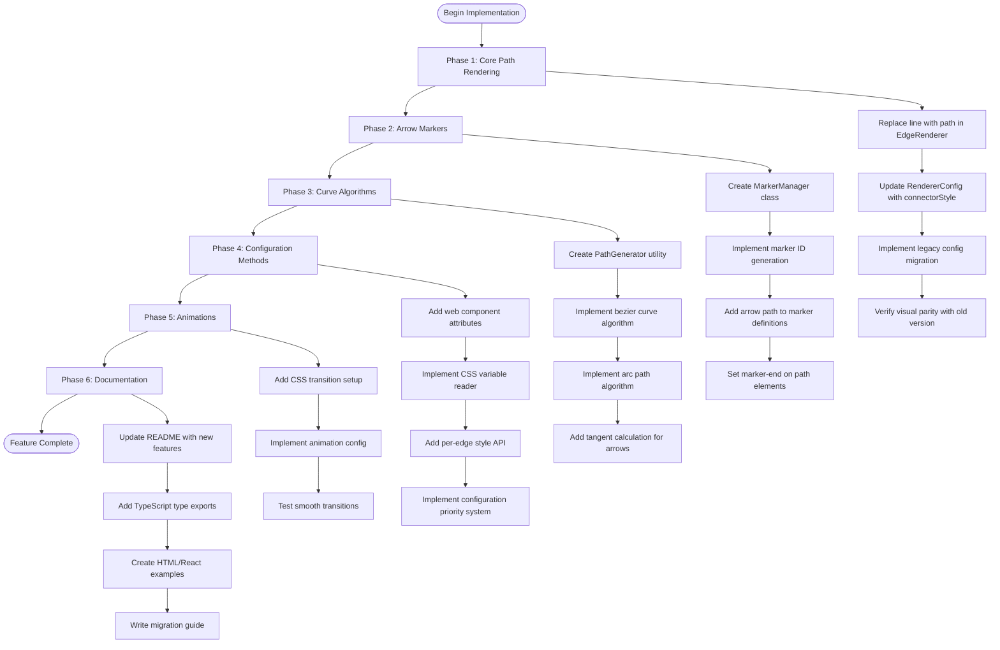

# Technical Design Document

## Overview

This feature extends the @luminastudy/blocks-graph library's connector rendering capabilities from basic SVG lines with limited styling to a comprehensive system supporting advanced visual features including arrows, curves, animations, and multiple configuration methods. The implementation upgrades the rendering engine from SVG `<line>` elements to `<path>` elements while maintaining full backward compatibility with existing configurations.

**Purpose**: This feature delivers rich connector customization capabilities to library users, enabling them to create visually expressive graphs that match their application's design requirements and effectively communicate relationship semantics through visual styling.

**Users**: Frontend developers integrating the blocks-graph library will utilize this feature through programmatic APIs, web component attributes, CSS custom properties, or per-edge style overrides to customize connector appearance in educational diagrams, dependency graphs, and workflow visualizations.

**Impact**: This modifies the existing rendering system by replacing the `renderEdges()` method in `GraphRenderer` (src/core/renderer.ts) to use SVG paths instead of lines, extends the `RendererConfig` interface (src/core/renderer-config.ts) with new connector style properties, adds new web component attributes to `BlocksGraph` (src/components/blocks-graph.ts), and introduces new utility modules for path generation and marker management.

### Goals

- Enable comprehensive connector styling with color, width, dash patterns, arrow markers, and curves
- Support multiple configuration methods (programmatic API, web component attributes, CSS variables, per-edge overrides)
- Upgrade from SVG line-based rendering to path-based rendering for advanced features
- Maintain 100% backward compatibility with existing edgeStyle configuration
- Achieve performance target of rendering hundreds of edges within 100ms
- Provide smooth animations and transitions for connector style changes

### Non-Goals

- Interactive connector editing (dragging, reshaping paths)
- Automatic edge routing algorithms to avoid node overlaps
- 3D or isometric connector rendering
- Real-time collaborative connector styling
- Server-side rendering of connectors (remains client-side SVG)
- Custom connector shapes beyond arrows (no diamonds, circles, custom SVG symbols)

## Architecture

### Existing Architecture Analysis

The current rendering architecture follows a clean separation of concerns:

**Current Domain Boundaries**:

- `GraphEngine` (src/core/graph-engine.ts): Builds graph structure, calculates layout, manages node positioning
- `GraphRenderer` (src/core/renderer.ts): Renders SVG representation of graph, handles edge and node visualization
- `BlocksGraph` (src/components/blocks-graph.ts): Web Component wrapper, manages DOM lifecycle, attribute handling
- `RendererConfig` (src/core/renderer-config.ts): Configuration interface for visual styling

**Current Edge Rendering Flow**:

```
BlocksGraph.render()
  → renderGraph() helper
    → GraphEngine.process()
      → GraphRenderer.render()
        → renderEdges() [MODIFICATION POINT]
```

**Existing Patterns to Preserve**:

- Configuration through constructor injection and updateConfig() method
- Partial configuration merging with defaults (spread operator pattern)
- SVG namespace constant usage for createElement
- CSS class naming convention (`edge`, `edge-prerequisite`, `edge-parent`)
- Data attributes for edge tracking (`data-from`, `data-to`)
- Opacity-based dimming for selection states

**Integration Points to Maintain**:

- `GraphRenderer.renderEdges()` signature and return type (SVGGElement)
- `RendererConfig` interface structure (nested objects for style categories)
- Web component attribute change callback pattern
- Default configuration merging strategy

### High-Level Architecture



**Architecture Integration**:

- **Existing patterns preserved**: Configuration injection, partial merging, SVG element creation patterns, CSS class conventions
- **New components rationale**: EdgeRenderer extracts edge rendering logic for single responsibility; MarkerManager handles SVG marker lifecycle and reuse; PathGenerator encapsulates curve calculation algorithms
- **Technology alignment**: Pure TypeScript and native SVG APIs, no new external dependencies
- **Steering compliance**: Maintains library's framework-agnostic philosophy, zero-dependency rendering core

### Technology Alignment

This feature extends the existing technology stack without introducing architectural changes:

**Existing Stack Alignment**:

- **SVG Rendering**: Continues using native SVG APIs with `document.createElementNS()`
- **TypeScript**: Extends existing interfaces following strict type checking patterns
- **Configuration Pattern**: Follows established partial config merging strategy
- **Web Component**: Extends existing attribute observation and change detection

**New Dependencies**: None. All features implemented with native browser APIs (SVG path commands, CSS custom properties, MutationObserver for CSS variable detection).

**Alignment with Existing Patterns**:

- Path generation uses same SVG namespace constants as current line rendering
- Marker definitions stored in SVG `<defs>` following SVG specification best practices
- Configuration structure extends existing nested object pattern (blockStyle, textStyle, edgeStyle)
- CSS variable integration follows Web Components shadow DOM styling patterns

### Key Design Decisions

#### Decision 1: SVG Path Elements vs. Line Elements

**Decision**: Replace SVG `<line>` elements with `<path>` elements for all connector rendering

**Context**: Current implementation uses simple `<line>` elements which only support straight connections. Requirements demand curves, arrows, and advanced styling that necessitate more flexible SVG primitives.

**Alternatives**:

1. **Keep lines, add paths for curves**: Maintain line elements for straight connectors, use paths only when curves enabled
2. **SVG polyline elements**: Use polyline for multi-segment connectors
3. **SVG path elements for all**: Unified rendering using path commands for both straight and curved

**Selected Approach**: SVG path elements for all connectors

All connectors rendered as SVG `<path>` elements using path commands:

- Straight: `M x1,y1 L x2,y2` (moveto, lineto)
- Bezier curve: `M x1,y1 C cx1,cy1 cx2,cy2 x2,y2` (cubic bezier)
- Arc: `M x1,y1 A rx,ry rotation large-arc sweep x2,y2`

**Rationale**:

- **Consistency**: Single code path for all connector types reduces complexity and test surface
- **Flexibility**: Path elements support all required features (straight, curves, markers) without conditional logic
- **Performance**: Path rendering performance equivalent to lines for simple cases, better for complex cases due to fewer DOM operations
- **Maintainability**: Unified rendering logic easier to extend with future shape types

**Trade-offs**:

- **Gained**: Unified rendering pipeline, support for all curve types, cleaner code architecture, easier to add future features
- **Sacrificed**: Slightly more complex path string generation for simple straight lines (minimal overhead), cannot use line-specific SVG attributes (all translate to path equivalents)

#### Decision 2: Unified Connector Styling vs. Type-Specific Styling

**Decision**: Implement unified connector styling that applies to all edge types, deprecating type-specific (prerequisite/parent) styling

**Context**: Current implementation separates edge styles by type (prerequisite vs. parent) in `edgeStyle.prerequisite` and `edgeStyle.parent`. Requirements specify unified styling approach for consistency.

**Alternatives**:

1. **Maintain type-specific**: Keep current prerequisite/parent separation, add unified option alongside
2. **Unified only**: Single connector style configuration applying to all edges
3. **Configurable approach**: Allow users to choose between unified or type-specific modes

**Selected Approach**: Unified configuration with backward-compatible migration

New configuration structure:

```typescript
connectorStyle: {
  // Unified properties applying to all edges
  stroke: string;
  strokeWidth: number;
  dashPattern?: string;
  arrowEnabled: boolean;
  arrowSize: number;
  curveType: 'straight' | 'bezier' | 'arc';
  curveTension: number;
  animation: {
    enabled: boolean;
    duration: number;
    easing: string;
  };
}
```

Legacy `edgeStyle.prerequisite` and `edgeStyle.parent` automatically merged into unified config during configuration processing.

**Rationale**:

- **Simplicity**: Single configuration object easier to understand and document than type-specific variants
- **User request**: Requirements explicitly specify unified styling based on user needs assessment
- **Consistency**: Ensures all edges have identical visual treatment, reducing visual clutter
- **Extensibility**: Adding new edge types (future) automatically inherit unified styling without config updates

**Trade-offs**:

- **Gained**: Simpler API surface, consistent visual styling, easier mental model for users, future-proof for new edge types
- **Sacrificed**: Cannot visually distinguish edge types through configuration (users can use per-edge overrides if needed), requires migration logic for backward compatibility

#### Decision 3: CSS Custom Properties Priority and Detection

**Decision**: Implement CSS custom properties as lowest priority with MutationObserver-based detection

**Context**: Requirements specify CSS variable support for theming integration. Must determine priority relative to programmatic config and attribute config, and mechanism for detecting CSS variable changes.

**Alternatives**:

1. **CSS highest priority**: CSS variables override all other configuration
2. **CSS lowest priority**: CSS variables as fallback when programmatic config absent
3. **CSS equal priority**: Last-set wins regardless of method
4. **Polling detection**: Periodically check CSS variable values
5. **MutationObserver**: Watch for style changes in shadow DOM
6. **No dynamic detection**: Read CSS variables only during initial render

**Selected Approach**: CSS variables as lowest priority with MutationObserver detection

Priority order (highest to lowest):

1. Per-edge style overrides (highest priority)
2. Programmatic API configuration (renderer.updateConfig())
3. Web component attributes
4. CSS custom properties (lowest priority, fallback)

CSS variable detection:

```typescript
private setupCSSVariableObserver(): void {
  const observer = new MutationObserver(() => {
    if (this.hasCSSVariablesChanged()) {
      this.applyCSSVariables();
      this.render();
    }
  });
  observer.observe(this.shadowRoot!, {
    attributes: true,
    attributeFilter: ['style']
  });
}
```

**Rationale**:

- **Explicit wins**: Programmatic configuration represents explicit developer intent and should override theme-level CSS
- **Theming integration**: CSS variables provide theme-level defaults without requiring JavaScript changes
- **Performance**: MutationObserver only fires on actual style changes, avoiding constant polling overhead
- **Flexibility**: Users can set base theme via CSS, override specific graphs programmatically

**Trade-offs**:

- **Gained**: Predictable priority system, efficient change detection, theme integration without breaking explicit config
- **Sacrificed**: CSS variables cannot override programmatic config (intentional), slight complexity in change detection logic, MutationObserver adds event listener overhead

## System Flows

### Connector Rendering Flow



### Configuration Update Flow



### Arrow Marker Management Flow



## Requirements Traceability

| Requirement | Summary                  | Components                         | Interfaces                                            | Flows                        |
| ----------- | ------------------------ | ---------------------------------- | ----------------------------------------------------- | ---------------------------- |
| 1.1-1.9     | Basic style properties   | EdgeRenderer, RendererConfig       | connectorStyle.stroke/width/dashPattern               | Connector Rendering Flow     |
| 2.1-2.9     | Arrow markers            | MarkerManager, EdgeRenderer        | connectorStyle.arrowEnabled/arrowSize/arrowColor      | Arrow Marker Management Flow |
| 3.1-3.9     | Curved paths             | PathGenerator, EdgeRenderer        | connectorStyle.curveType/curveTension, generatePath() | Connector Rendering Flow     |
| 4.1-4.9     | Programmatic API         | GraphRenderer, RendererConfig      | updateConfig(), constructor                           | Configuration Update Flow    |
| 5.1-5.9     | Per-edge customization   | EdgeRenderer, EdgeStyleMap         | getEdgeStyle(), per-edge overrides                    | Connector Rendering Flow     |
| 6.1-6.9     | CSS variables            | BlocksGraph, CSS variable reader   | applyCSSVariables(), MutationObserver                 | Configuration Update Flow    |
| 7.1-7.9     | Web component attributes | BlocksGraph                        | observedAttributes, attributeChangedCallback          | Configuration Update Flow    |
| 8.1-8.8     | Unified styling          | RendererConfig, EdgeRenderer       | connectorStyle (unified), backward compat merge       | Connector Rendering Flow     |
| 9.1-9.9     | Backward compatibility   | LegacyConfigMigrator               | migrateEdgeStyle(), edgeStyle.prerequisite/parent     | Configuration Update Flow    |
| 10.1-10.9   | Animations               | EdgeRenderer, CSS transitions      | connectorStyle.animation, CSS transition setup        | Connector Rendering Flow     |
| 11.1-11.9   | Performance              | MarkerManager, EdgeRenderer        | Marker reuse, selective re-render, caching            | Arrow Marker Management Flow |
| 12.1-12.9   | Documentation            | README, TypeScript types, examples | API docs, type definitions, HTML/React examples       | N/A                          |

## Components and Interfaces

### Rendering Layer

#### EdgeRenderer

**Responsibility & Boundaries**

- **Primary Responsibility**: Renders all edge connections as SVG path elements with styling, markers, and curves
- **Domain Boundary**: Edge visualization layer - owns SVG path generation and styling application
- **Data Ownership**: Manages per-edge style overrides, marker ID assignments, and edge visibility state

**Dependencies**

- **Inbound**: GraphRenderer calls renderEdges() method
- **Outbound**: PathGenerator for curve calculations, MarkerManager for arrow definitions
- **External**: Native SVG DOM APIs (createElementNS, setAttribute)

**Contract Definition**

```typescript
interface EdgeRenderer {
  renderEdges(
    graph: BlockGraph,
    positioned: PositionedBlock[],
    config: RendererConfig
  ): SVGGElement

  setEdgeStyle(edgeId: string, style: Partial<ConnectorStyle>): void
  clearEdgeStyle(edgeId: string): void
  getEdgeStyle(edgeId: string): ConnectorStyle | undefined
}

interface ConnectorStyle {
  stroke: string
  strokeWidth: number
  dashPattern?: string
  arrowEnabled: boolean
  arrowSize: number
  arrowColor?: string
  curveType: 'straight' | 'bezier' | 'arc'
  curveTension: number
  opacity?: number
  animation: AnimationConfig
}

interface AnimationConfig {
  enabled: boolean
  duration: number
  easing: 'linear' | 'ease' | 'ease-in' | 'ease-out' | 'ease-in-out'
}
```

**Preconditions**:

- BlockGraph contains valid edge relationships with from/to IDs
- PositionedBlock array includes positions for all referenced node IDs
- RendererConfig contains valid connectorStyle configuration

**Postconditions**:

- Returns SVGGElement containing all rendered edge path elements
- All visible edges have corresponding SVG paths in the returned group
- Marker definitions created in SVG defs for edges with arrows enabled
- Per-edge style overrides applied where specified

**Invariants**:

- Edge paths always rendered before block nodes (z-order)
- Marker IDs consistently derived from style properties for reuse
- Invisible edges (based on showPrerequisites/showParents) never rendered

#### PathGenerator

**Responsibility & Boundaries**

- **Primary Responsibility**: Generates SVG path data strings for straight lines, bezier curves, and arcs
- **Domain Boundary**: Geometric calculation layer - pure functions for path mathematics
- **Data Ownership**: No persistent state - stateless utility module

**Dependencies**

- **Inbound**: EdgeRenderer calls path generation functions
- **Outbound**: None (pure calculations)
- **External**: Math library for trigonometric calculations

**Contract Definition**

```typescript
interface PathGenerator {
  generateStraightPath(from: Point, to: Point): string
  generateBezierPath(from: Point, to: Point, tension: number): string
  generateArcPath(from: Point, to: Point, tension: number): string
  calculateTangent(from: Point, to: Point, curveType: CurveType): number
}

interface Point {
  x: number
  y: number
}

type CurveType = 'straight' | 'bezier' | 'arc'
```

**Path String Format**:

- Straight: `M ${x1},${y1} L ${x2},${y2}`
- Bezier: `M ${x1},${y1} C ${cx1},${cy1} ${cx2},${cy2} ${x2},${y2}`
- Arc: `M ${x1},${y1} A ${rx},${ry} 0 0 1 ${x2},${y2}`

**Bezier Control Point Calculation**:

```
tension: 0.0 (straight) to 1.0 (maximum curve)
distance = sqrt((x2-x1)² + (y2-y1)²)
offset = distance * tension * 0.5
cx1 = x1, cy1 = y1 + offset
cx2 = x2, cy2 = y2 - offset
```

**Preconditions**:

- From and to points have valid numeric coordinates
- Tension value between 0.0 and 1.0
- Curve type is one of the supported types

**Postconditions**:

- Returns valid SVG path data string parseable by SVG renderer
- Path starts at from point, ends at to point
- Curve smoothness corresponds to tension parameter

**Invariants**:

- Straight paths always produce single line segment
- Bezier paths always use cubic bezier (4 control points)
- Generated paths compatible with SVG 1.1 specification

#### MarkerManager

**Responsibility & Boundaries**

- **Primary Responsibility**: Creates and manages SVG marker definitions for arrow heads, ensuring reuse and preventing duplication
- **Domain Boundary**: SVG marker lifecycle management - owns marker def creation and ID assignment
- **Data Ownership**: Maintains registry of created markers and their style signatures

**Dependencies**

- **Inbound**: EdgeRenderer requests marker IDs for edge rendering
- **Outbound**: SVG defs element for marker definition storage
- **External**: Native SVG DOM APIs for marker creation

**Contract Definition**

```typescript
interface MarkerManager {
  getOrCreateMarker(style: ArrowStyle, svgDefs: SVGDefsElement): string

  clearMarkers(svgDefs: SVGDefsElement): void
  getMarkerCount(): number
}

interface ArrowStyle {
  color: string
  size: number
  strokeWidth: number
}
```

**Marker ID Generation**:

```typescript
function generateMarkerId(style: ArrowStyle): string {
  const hash = `${style.color}-${style.size}-${style.strokeWidth}`
  return `arrow-${hashCode(hash)}`
}
```

**Marker Definition Structure**:

```xml
<marker id="arrow-hash123"
        viewBox="0 0 10 10"
        refX="9"
        refY="5"
        markerWidth="${size}"
        markerHeight="${size}"
        orient="auto">
  <path d="M 0 0 L 10 5 L 0 10 z"
        fill="${color}"
        stroke="none"/>
</marker>
```

**Preconditions**:

- SVG defs element exists in the document
- Arrow style contains valid color, size, and strokeWidth
- Marker size greater than 0

**Postconditions**:

- Returns marker ID that can be referenced in marker-end attribute
- Marker definition exists in SVG defs if newly created
- Duplicate style requests return existing marker ID (no duplication)

**Invariants**:

- Each unique style signature has exactly one marker definition
- Marker IDs remain stable across multiple requests for same style
- Marker definitions persist until clearMarkers() called

### Configuration Layer

#### Extended RendererConfig

**Responsibility & Boundaries**

- **Primary Responsibility**: Defines type-safe configuration interface for all connector styling properties
- **Domain Boundary**: Configuration contract layer - type definitions only, no behavior
- **Data Ownership**: Type definitions for configuration data structures

**Contract Definition**

```typescript
interface RendererConfig {
  // Existing properties (unchanged)
  language: 'en' | 'he'
  showPrerequisites: boolean
  showParents: boolean
  selectedBlockId?: string | null
  visibleBlocks?: Set<string>
  dimmedBlocks?: Set<string>
  blockStyle: BlockStyle
  textStyle: TextStyle

  // New unified connector style
  connectorStyle: {
    stroke: string
    strokeWidth: number
    dashPattern?: string
    arrowEnabled: boolean
    arrowSize: number
    arrowColor?: string
    curveType: 'straight' | 'bezier' | 'arc'
    curveTension: number
    animation: {
      enabled: boolean
      duration: number
      easing: 'linear' | 'ease' | 'ease-in' | 'ease-out' | 'ease-in-out'
    }
  }

  // Legacy support (deprecated, still accepted)
  edgeStyle?: {
    prerequisite?: LegacyEdgeStyle
    parent?: LegacyEdgeStyle
  }
}

interface LegacyEdgeStyle {
  stroke: string
  strokeWidth: number
  dashArray?: string
}
```

**Default Configuration**:

```typescript
const DEFAULT_CONNECTOR_STYLE: ConnectorStyle = {
  stroke: '#4a90e2',
  strokeWidth: 2,
  dashPattern: undefined,
  arrowEnabled: false,
  arrowSize: 8,
  arrowColor: undefined, // Uses stroke color
  curveType: 'straight',
  curveTension: 0.5,
  animation: {
    enabled: false,
    duration: 300,
    easing: 'ease-in-out',
  },
}
```

**Migration from Legacy Config**:

```typescript
function migrateEdgeStyle(config: Partial<RendererConfig>): RendererConfig {
  if (config.edgeStyle) {
    // Merge prerequisite and parent styles
    const prereq = config.edgeStyle.prerequisite
    const parent = config.edgeStyle.parent

    config.connectorStyle = {
      ...DEFAULT_CONNECTOR_STYLE,
      stroke:
        prereq?.stroke || parent?.stroke || DEFAULT_CONNECTOR_STYLE.stroke,
      strokeWidth: prereq?.strokeWidth || DEFAULT_CONNECTOR_STYLE.strokeWidth,
      dashPattern: prereq?.dashArray || parent?.dashArray,
    }
  }
  return config as RendererConfig
}
```

#### LegacyConfigMigrator

**Responsibility & Boundaries**

- **Primary Responsibility**: Converts legacy edgeStyle configuration to new connectorStyle format
- **Domain Boundary**: Configuration transformation layer - handles backward compatibility
- **Data Ownership**: No persistent state - pure transformation function

**Dependencies**

- **Inbound**: GraphRenderer constructor reads legacy config
- **Outbound**: None (pure function)
- **External**: None

**Contract Definition**

```typescript
interface LegacyConfigMigrator {
  migrateConfig(config: Partial<RendererConfig>): RendererConfig
  hasLegacyConfig(config: Partial<RendererConfig>): boolean
}
```

**Migration Logic**:

1. Check if `edgeStyle.prerequisite` or `edgeStyle.parent` exists
2. If exists, extract stroke, strokeWidth, dashArray properties
3. Map to new connectorStyle properties:
   - `stroke` → `connectorStyle.stroke`
   - `strokeWidth` → `connectorStyle.strokeWidth`
   - `dashArray` → `connectorStyle.dashPattern`
4. Merge with defaults for properties not in legacy config
5. Set connectorStyle in config, mark edgeStyle as consumed

**Preconditions**:

- Config object may contain legacy edgeStyle structure
- Legacy edgeStyle contains valid stroke and strokeWidth values

**Postconditions**:

- Returns config with connectorStyle populated
- Legacy edgeStyle preserved in config for reference
- All defaults applied for properties not specified in legacy config

**Invariants**:

- Migration produces visually identical output to legacy rendering
- No data loss during migration process
- Idempotent - migrating already-migrated config has no effect

### Web Component Layer

#### BlocksGraph Extended Attributes

**Responsibility & Boundaries**

- **Primary Responsibility**: Exposes connector style properties as HTML attributes for declarative configuration
- **Domain Boundary**: Web Component attribute handling layer
- **Data Ownership**: Manages attribute-to-config mapping and change detection

**New Observed Attributes**:

```typescript
static get observedAttributes(): string[] {
  return [
    // Existing attributes
    'language',
    'show-prerequisites',
    'show-parents',
    'node-width',
    'node-height',
    'horizontal-spacing',
    'vertical-spacing',
    // New connector style attributes
    'edge-color',
    'edge-width',
    'edge-dash-pattern',
    'edge-arrows',
    'edge-arrow-size',
    'edge-curve-type',
    'edge-curve-tension',
    'edge-animation-enabled',
    'edge-animation-duration',
  ];
}
```

**Attribute Change Handler Extension**:

```typescript
attributeChangedCallback(
  name: string,
  oldValue: string | null,
  newValue: string | null
): void {
  if (oldValue === newValue) return;

  const connectorUpdates: Partial<ConnectorStyle> = {};

  switch (name) {
    case 'edge-color':
      connectorUpdates.stroke = newValue || DEFAULT_CONNECTOR_STYLE.stroke;
      break;
    case 'edge-width':
      connectorUpdates.strokeWidth = Number.parseInt(newValue || '2', 10);
      break;
    case 'edge-dash-pattern':
      connectorUpdates.dashPattern = newValue || undefined;
      break;
    case 'edge-arrows':
      connectorUpdates.arrowEnabled = newValue === 'true';
      break;
    case 'edge-curve-type':
      if (newValue === 'straight' || newValue === 'bezier' || newValue === 'arc') {
        connectorUpdates.curveType = newValue;
      }
      break;
    // ... other cases
  }

  if (Object.keys(connectorUpdates).length > 0) {
    this.renderer.updateConfig({ connectorStyle: connectorUpdates });
    this.render();
  }
}
```

**Preconditions**:

- Attribute values conform to expected formats (numbers, booleans, enums)
- Web component connected to DOM

**Postconditions**:

- Renderer config updated with new connector style properties
- Graph re-rendered with updated styles
- Invalid attribute values logged as warnings, defaults used

**Invariants**:

- Attribute changes always trigger config update and re-render
- Invalid values never crash component, always fallback to defaults

#### CSS Variable Reader

**Responsibility & Boundaries**

- **Primary Responsibility**: Reads CSS custom properties from shadow DOM and applies to connector configuration
- **Domain Boundary**: CSS-to-config bridge layer
- **Data Ownership**: Caches computed CSS variable values for comparison

**Dependencies**

- **Inbound**: BlocksGraph lifecycle methods
- **Outbound**: GraphRenderer.updateConfig()
- **External**: getComputedStyle() API, MutationObserver API

**Contract Definition**

```typescript
interface CSSVariableReader {
  readCSSVariables(): Partial<ConnectorStyle>
  applyCSSVariables(shadowRoot: ShadowRoot): void
  hasCSSVariablesChanged(): boolean
  setupObserver(shadowRoot: ShadowRoot): void
}
```

**Supported CSS Variables**:

```css
--edge-stroke-color: <color> --edge-stroke-width: <number>
  --edge-dash-pattern: <string> --edge-arrow-enabled: true | false
  --edge-arrow-size: <number> --edge-curve-type: straight | bezier | arc
  --edge-curve-tension: <number> --edge-animation-enabled: true | false
  --edge-animation-duration: <number>;
```

**Change Detection**:

```typescript
private cssVariableCache: Map<string, string> = new Map();

function hasCSSVariablesChanged(): boolean {
  const current = this.readCSSVariables();
  const changed = !deepEqual(current, this.cssVariableCache);
  if (changed) {
    this.cssVariableCache = current;
  }
  return changed;
}
```

**Preconditions**:

- Shadow DOM attached to web component
- CSS variables defined on host element or inherited

**Postconditions**:

- CSS variable values applied to connector config as lowest priority
- Changes detected and trigger re-render
- Invalid CSS values ignored, no config update

**Invariants**:

- CSS variables never override programmatic or attribute config
- Observer active for component lifecycle
- Cache cleared on component disconnect

## Data Models

### Configuration Data Model

The connector configuration model follows the existing nested structure pattern established by `blockStyle` and `textStyle`:

```typescript
interface ConnectorStyleConfig {
  // Basic visual properties
  stroke: string // Color (hex, rgb, named)
  strokeWidth: number // Width in pixels (1-10)
  dashPattern?: string // SVG dash array (e.g., "5,5", "2,3")

  // Arrow marker properties
  arrowEnabled: boolean // Enable/disable arrow heads
  arrowSize: number // Arrow size in pixels (4-16)
  arrowColor?: string // Arrow color (defaults to stroke)

  // Curve properties
  curveType: CurveType // Path shape
  curveTension: number // Curve intensity (0.0-1.0)

  // Animation properties
  animation: AnimationConfig
}

type CurveType = 'straight' | 'bezier' | 'arc'

interface AnimationConfig {
  enabled: boolean
  duration: number // Milliseconds (100-1000)
  easing: EasingFunction
}

type EasingFunction = 'linear' | 'ease' | 'ease-in' | 'ease-out' | 'ease-in-out'
```

**Validation Rules**:

- `stroke`: Must be valid CSS color (validated via CSS parsing)
- `strokeWidth`: Integer 1-10 inclusive, defaults to 2
- `dashPattern`: Optional string matching SVG dasharray format `\d+(,\d+)*`
- `arrowSize`: Integer 4-16 inclusive, defaults to 8
- `curveTension`: Float 0.0-1.0 inclusive, defaults to 0.5
- `animation.duration`: Integer 100-1000 inclusive, defaults to 300

**Default Values** (from DEFAULT_CONNECTOR_STYLE):

```typescript
{
  stroke: '#4a90e2',
  strokeWidth: 2,
  dashPattern: undefined,
  arrowEnabled: false,
  arrowSize: 8,
  arrowColor: undefined,
  curveType: 'straight',
  curveTension: 0.5,
  animation: {
    enabled: false,
    duration: 300,
    easing: 'ease-in-out',
  },
}
```

### Per-Edge Style Override Model

Per-edge customization uses a Map structure for O(1) lookup performance:

```typescript
type EdgeId = string // Format: "${fromNodeId}-${toNodeId}"

interface EdgeStyleOverride {
  edgeId: EdgeId
  style: Partial<ConnectorStyleConfig>
  priority: number // Higher number = higher priority
}

class EdgeStyleMap {
  private overrides: Map<EdgeId, EdgeStyleOverride>

  set(edgeId: EdgeId, style: Partial<ConnectorStyleConfig>): void
  get(edgeId: EdgeId): ConnectorStyleConfig | undefined
  clear(edgeId: EdgeId): void
  clearAll(): void
  has(edgeId: EdgeId): boolean
}
```

**Edge ID Generation**:

```typescript
function generateEdgeId(edge: GraphEdge): EdgeId {
  return `${edge.from}-${edge.to}`
}
```

**Style Resolution with Overrides**:

```typescript
function resolveEdgeStyle(
  edgeId: EdgeId,
  globalConfig: ConnectorStyleConfig,
  overrides: EdgeStyleMap
): ConnectorStyleConfig {
  const override = overrides.get(edgeId)
  if (!override) {
    return globalConfig
  }
  return { ...globalConfig, ...override.style }
}
```

**Usage Example**:

```typescript
// Set custom style for specific edge
renderer.setEdgeStyle('node1-node2', {
  stroke: '#ff0000',
  strokeWidth: 4,
  arrowEnabled: true,
})

// Clear override
renderer.clearEdgeStyle('node1-node2')
```

## Error Handling

### Error Strategy

The connector styling feature follows a graceful degradation strategy with clear error boundaries:

1. **Configuration Errors**: Invalid values fallback to defaults, warnings logged
2. **Rendering Errors**: Skip problematic edge, continue rendering others
3. **CSS Variable Errors**: Ignore invalid values, use programmatic config
4. **Path Generation Errors**: Fallback to straight path if curve calculation fails

### Error Categories and Responses

**User Errors** (Configuration Issues):

- **Invalid color value**: Validate using CSS color parsing; if invalid, use default color and log warning
- **Out-of-range numeric values**: Clamp to valid range (e.g., tension < 0 → 0, tension > 1 → 1)
- **Unsupported curve type**: Fallback to 'straight' curve type, log warning
- **Invalid dash pattern format**: Ignore pattern, render solid line, log warning

**System Errors** (Runtime Failures):

- **Path generation failure**: If curve calculation throws, catch and generate straight path
- **Marker creation failure**: If SVG marker creation fails, render edge without arrow
- **CSS variable read failure**: If getComputedStyle fails, skip CSS variable application

**Business Logic Errors** (Data Integrity):

- **Missing node positions**: Skip edge rendering, log error (same as current behavior)
- **Circular edge reference**: Render as best effort, no special handling needed
- **Duplicate edge IDs**: Later override wins, no error (intentional)

### Error Flow Visualization



### Monitoring

**Console Logging**:

- Warning for invalid configuration values with specific property and value
- Error for path generation failures with edge ID and error details
- Info for successful marker reuse (debug mode only)

**Performance Metrics**:

- Edge render time tracked per frame (if > 100ms, log warning)
- Marker count tracked and logged if exceeds 100 (potential optimization issue)
- Path generation time sampled (if > 5ms per edge, log performance warning)

**Error Tracking**:

```typescript
interface EdgeRenderError {
  edgeId: string;
  errorType: 'config' | 'path' | 'marker' | 'render';
  message: string;
  timestamp: number;
}

// Collect errors for potential debugging
private renderErrors: EdgeRenderError[] = [];
```

**User-Visible Feedback**:

- No visual errors shown (graceful degradation)
- Console warnings viewable in browser dev tools
- Invalid edges simply not rendered or rendered with fallbacks

## Testing Strategy

### Unit Tests

**EdgeRenderer**:

1. Test renderEdges() creates correct SVG path elements for valid graph
2. Test straight path rendering produces correct path data strings
3. Test bezier curve path generation with various tension values
4. Test arc path generation follows SVG arc command format
5. Test per-edge style overrides applied correctly, override global config
6. Test marker-end attribute set when arrows enabled
7. Test CSS classes applied correctly (edge, edge-prerequisite, edge-parent)
8. Test dimming logic sets opacity to 0.3 when endpoints dimmed
9. Test edge visibility filtering based on showPrerequisites/showParents

**PathGenerator**:

1. Test straight path generates valid M-L command string
2. Test bezier control point calculation for various tension values
3. Test arc path includes correct radius and sweep parameters
4. Test tangent calculation returns correct angle for arrow alignment
5. Test edge cases (zero distance, overlapping points)

**MarkerManager**:

1. Test marker ID generation produces consistent IDs for same style
2. Test marker reuse when identical style requested multiple times
3. Test new marker creation when unique style encountered
4. Test marker definition includes correct path and attributes
5. Test clearMarkers() removes all markers from defs
6. Test getMarkerCount() returns accurate marker registry size

**LegacyConfigMigrator**:

1. Test prerequisite style migrated to connectorStyle correctly
2. Test parent style migrated to connectorStyle correctly
3. Test merged style when both prerequisite and parent exist
4. Test dashArray property mapped to dashPattern correctly
5. Test default values applied for missing properties

**CSSVariableReader**:

1. Test CSS variables read from computed styles correctly
2. Test invalid CSS variable values ignored
3. Test change detection triggers only when values actually change
4. Test MutationObserver setup and cleanup
5. Test priority system places CSS variables lowest

### Integration Tests

**End-to-End Configuration Flow**:

1. Set connector style via programmatic API, verify edges rendered with style
2. Update connector style via web component attribute, verify re-render
3. Apply CSS variables, verify fallback behavior when no programmatic config
4. Set per-edge override, verify edge rendered differently from global style
5. Test configuration priority order (per-edge > API > attributes > CSS)

**Arrow Marker Integration**:

1. Enable arrows via config, verify marker definitions created in defs
2. Render multiple edges with same arrow style, verify single marker reused
3. Render edges with different arrow styles, verify multiple markers created
4. Update arrow config, verify marker-end attributes updated
5. Disable arrows, verify marker-end attributes removed

**Curve Path Integration**:

1. Render bezier curves with various tensions, verify smooth curves
2. Render arc paths, verify correct curvature
3. Switch from straight to curved, verify path data changes
4. Render curved paths with arrows, verify arrows align with curve tangent

**Animation Integration**:

1. Enable animations, verify CSS transitions applied to path elements
2. Change connector color, verify smooth transition animation
3. Change connector width, verify smooth width transition
4. Add/remove edges, verify fade-in/fade-out animations

**Backward Compatibility**:

1. Use legacy edgeStyle.prerequisite config, verify migration to connectorStyle
2. Use legacy edgeStyle.parent config, verify migration to connectorStyle
3. Mix legacy and new config, verify new config takes precedence
4. Render graph with legacy config, verify visually identical to old version

### E2E Tests

**User Configuration Workflows**:

1. Developer adds web component with edge attributes, verifies custom styling in browser
2. Developer updates attributes dynamically via JavaScript, verifies instant re-render
3. Developer uses programmatic API to set connector style, verifies applied
4. Developer sets CSS variables in stylesheet, verifies theme-level styling

**Visual Regression Tests**:

1. Render reference graph with default styles, capture screenshot
2. Render same graph with custom colors, verify only colors changed
3. Render graph with arrows enabled, verify arrows present
4. Render graph with bezier curves, verify curves rendered smoothly
5. Compare old version (line-based) with new version (path-based), verify identical for defaults

**Performance Tests**:

1. Render graph with 100 edges, verify render time < 100ms
2. Render graph with 500 edges, verify render time < 500ms
3. Update style of single edge, verify only affected edge re-rendered
4. Enable arrows for 100 edges with same style, verify single marker created
5. Animate 100 edges simultaneously, verify frame rate > 30 FPS

**Browser Compatibility**:

1. Test in Chrome 61+, verify all features work
2. Test in Firefox 60+, verify curve rendering
3. Test in Safari 11+, verify CSS variable reading
4. Test in Edge 79+, verify marker definitions

## Performance & Scalability

### Performance Targets

- **Render Time**: Render 100 edges within 50ms on modern desktop hardware
- **Animation Performance**: Maintain 60 FPS during connector style transitions
- **Marker Optimization**: Reuse markers to limit defs element to < 100 definitions
- **Memory**: Per-edge style override map should not exceed 1MB for 1000 edges
- **CSS Variable Detection**: Change detection latency < 16ms (1 frame)

### Optimization Strategies

**Marker Reuse**:

```typescript
// Hash-based marker ID ensures identical styles share markers
function generateMarkerId(style: ArrowStyle): string {
  const hash = hashCode(`${style.color}-${style.size}-${style.strokeWidth}`)
  return `arrow-${hash}`
}
```

**Selective Re-rendering**:

- Only re-render edges when their specific style changes
- Track "dirty" edge IDs and skip re-render for unchanged edges
- Use requestAnimationFrame batching for multiple simultaneous updates

**Path Calculation Caching**:

```typescript
private pathCache: Map<string, string> = new Map();

function getOrGeneratePath(from: Point, to: Point, type: CurveType): string {
  const key = `${from.x},${from.y}-${to.x},${to.y}-${type}`;
  if (this.pathCache.has(key)) {
    return this.pathCache.get(key)!;
  }
  const path = this.generatePath(from, to, type);
  this.pathCache.set(key, path);
  return path;
}
```

**CSS Variable Caching**:

- Cache computed CSS variable values to avoid repeated getComputedStyle calls
- Only re-read CSS variables when MutationObserver fires
- Use Map for O(1) lookup of cached values

**Batched DOM Updates**:

- Collect all path elements before appending to group
- Use DocumentFragment for batch insertion
- Apply all style attributes before adding elements to DOM

### Scalability Considerations

**Large Graphs** (1000+ edges):

- Marker reuse critical for memory efficiency
- Consider virtualization for off-screen edges (future enhancement)
- Path caching becomes more valuable with repeated renders

**Real-Time Updates**:

- Selective re-render only changed edges
- Debounce rapid configuration changes (< 16ms)
- Use CSS transitions for smooth visual updates

**Browser Limitations**:

- SVG marker definitions limited by browser (typically 10000+)
- Path calculation CPU-bound, consider Web Workers for very large graphs
- Animation performance depends on browser compositing

## Migration Strategy

This feature requires no data migration as it extends the existing configuration model with backward compatibility.

### Implementation Phases



**Phase 1: Core Path Rendering** (Foundation)

- Replace SVG line elements with path elements in renderEdges()
- Implement straight path generation (M-L commands)
- Add connectorStyle to RendererConfig interface
- Implement legacy edgeStyle migration
- Verify visual output identical to previous version
- **Validation**: All existing tests pass, visual regression tests pass

**Phase 2: Arrow Markers** (Visual Enhancement)

- Create MarkerManager class for marker lifecycle
- Implement marker ID generation and reuse logic
- Generate SVG marker definitions with arrow paths
- Apply marker-end attributes to path elements
- Test marker optimization (single marker for identical styles)
- **Validation**: Arrows render correctly, markers reused, no duplication

**Phase 3: Curve Algorithms** (Path Variety)

- Create PathGenerator utility module
- Implement bezier curve control point calculation
- Implement arc path generation
- Add tangent calculation for arrow alignment with curves
- Test curve smoothness across tension range
- **Validation**: Curves render smoothly, arrows align correctly

**Phase 4: Configuration Methods** (User Interface)

- Add new observed attributes to BlocksGraph
- Implement attributeChangedCallback extensions
- Create CSSVariableReader with MutationObserver
- Add per-edge style API (setEdgeStyle, clearEdgeStyle)
- Implement configuration priority system
- **Validation**: All config methods work, priority order correct

**Phase 5: Animations** (Polish)

- Add CSS transition properties to path elements
- Implement animation configuration options
- Test transition smoothness for color, width, path changes
- Verify performance during animations (60 FPS target)
- **Validation**: Smooth animations, no performance degradation

**Phase 6: Documentation** (Developer Experience)

- Update README with connector styling section
- Export new TypeScript types from index.ts
- Create HTML example demonstrating connector features
- Create React example with connector customization
- Write migration guide for upgrading from legacy config
- **Validation**: Documentation complete, examples runnable

### Rollback Strategy

**Rollback Triggers**:

- Visual regression detected in default rendering
- Performance degradation > 50% in edge rendering
- Backward compatibility broken (legacy config fails)
- Critical bug in path generation causing render failures

**Rollback Process**:

1. Revert EdgeRenderer.renderEdges() to line-based implementation
2. Remove connectorStyle from RendererConfig exports
3. Remove new web component attributes
4. Restore previous version tag in package.json
5. Publish hotfix release

**Mitigation**:

- Feature flag for path-based rendering (enable/disable)
- Comprehensive visual regression test suite
- Performance benchmarks in CI pipeline
- Beta release period for community testing
