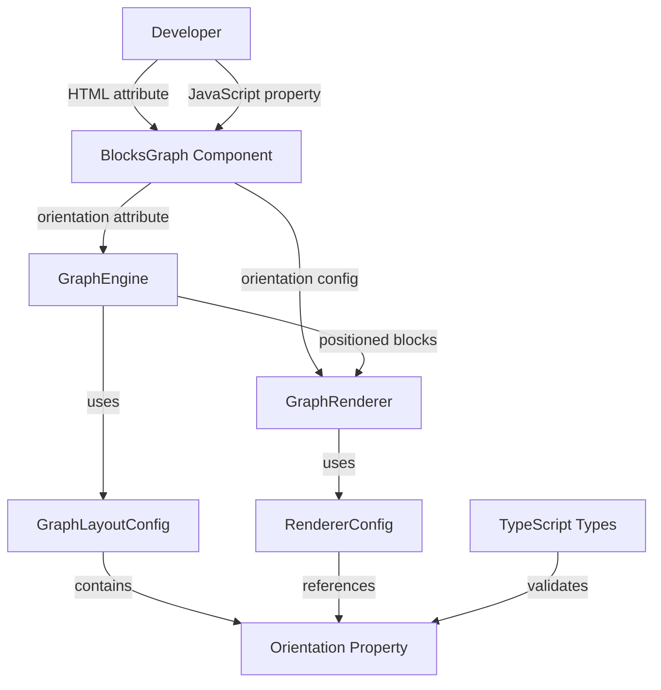
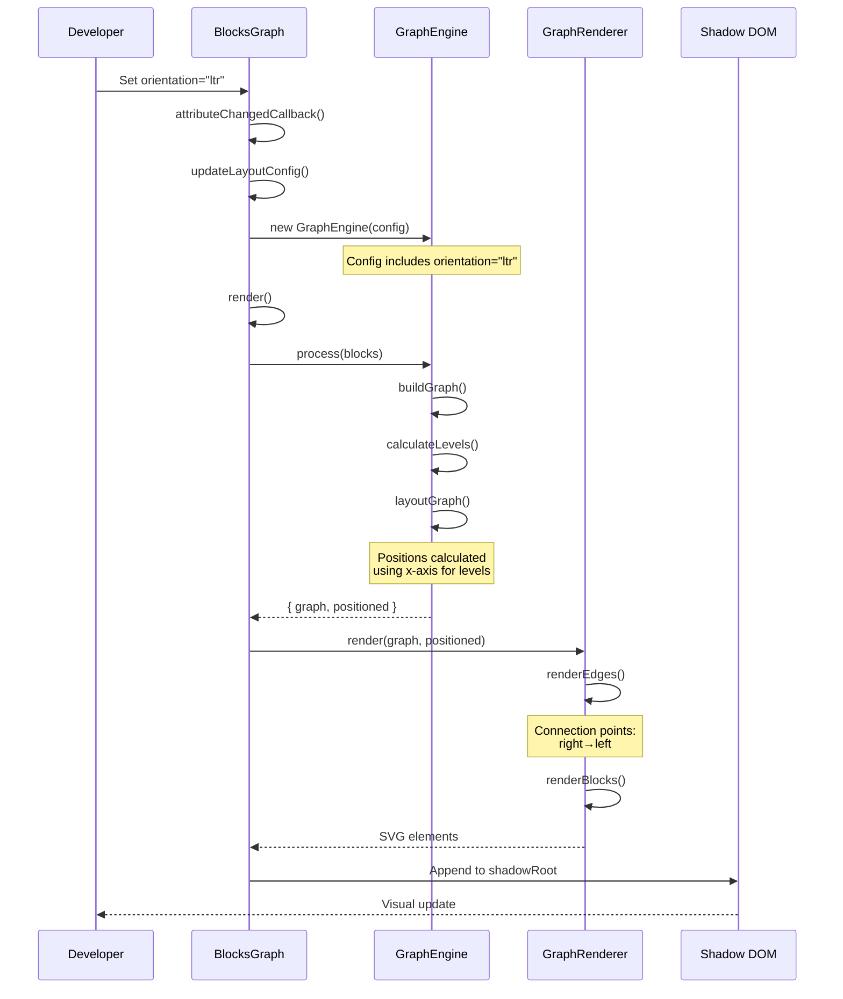
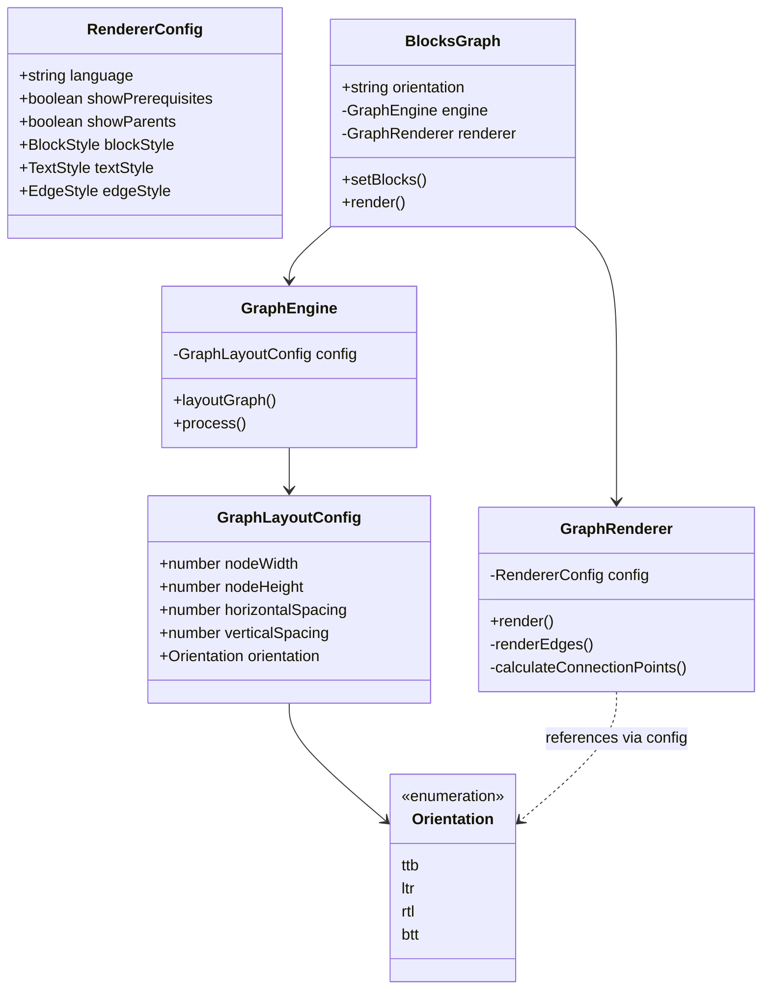

# Technical Design: Graph Orientation

## Overview

This feature extends the `@lumina-study/blocks-graph` Web Component to support configurable graph orientation, enabling developers to control the directional flow of node layouts. The implementation adds four orientation modes—top-to-bottom (TTB), left-to-right (LTR), right-to-left (RTL), and bottom-to-top (BTT)—while maintaining full backward compatibility with the existing top-to-bottom default behavior.

**Purpose**: This feature delivers flexible graph visualization capabilities to developers building educational platforms, organizational charts, and process flow diagrams. It specifically addresses internationalization needs for right-to-left language users (Hebrew, Arabic) and provides visual flexibility for different use cases.

**Users**: Frontend developers integrating the blocks-graph component will utilize orientation configuration through both declarative HTML attributes and imperative JavaScript API to match their application's visual requirements and cultural contexts.

**Impact**: This feature modifies the existing layout engine and rendering system to support multiple orientation axes. The changes extend three core components (BlocksGraph, GraphEngine, GraphRenderer) with minimal modifications to their existing responsibilities. All current implementations continue to function identically without any code changes.

### Goals

- Enable four orientation modes (TTB, LTR, RTL, BTT) through declarative and imperative APIs
- Maintain O(n) layout calculation performance across all orientations
- Preserve 100% backward compatibility with existing implementations
- Provide type-safe TypeScript definitions with compile-time validation
- Support dynamic orientation changes without data reload

### Non-Goals

- Curved or diagonal edge routing algorithms (edges remain straight lines)
- Automatic orientation detection based on language or content
- Animation transitions between orientation changes (future enhancement)
- Custom orientation angles beyond the four cardinal directions
- Mixed orientation within a single graph (all nodes use same orientation)

## Architecture

### Existing Architecture Analysis

The blocks-graph library follows a clean separation of concerns with three primary layers:

**Component Layer** (`BlocksGraph`): Web Component managing DOM lifecycle, attribute observation, and user events. Currently handles seven observed attributes including layout dimensions and display toggles.

**Layout Layer** (`GraphEngine`): Pure calculation engine performing graph building, level calculation, and position computation. Uses a fixed top-to-bottom algorithm where `y = level × (nodeHeight + verticalSpacing)`.

**Rendering Layer** (`GraphRenderer`): SVG generation module creating visual elements from positioned blocks. Hardcoded to draw edges from bottom-center to top-center connection points.

**Existing Patterns Preserved**:

- Configuration object pattern with defaults merged with user overrides
- Attribute-to-property synchronization in Web Component
- Immutable position calculation returning new PositionedBlock arrays
- Separation of graph topology (GraphEngine) from visual presentation (GraphRenderer)

**Integration Points Maintained**:

- GraphLayoutConfig interface extension (additive change only)
- BlocksGraph.observedAttributes array (append new attribute)
- GraphEngine constructor signature (backward compatible with optional property)
- GraphRenderer.renderEdges connection point calculation (conditional logic based on orientation)

### High-Level Architecture



### Technology Alignment

This feature extends the existing TypeScript-based architecture without introducing new dependencies or patterns.

**Existing Stack Alignment**:

- **TypeScript 5.7.2**: Extends existing interfaces with union types for orientation values
- **Web Components**: Adds one new observed attribute following existing attribute patterns
- **esbuild**: No build configuration changes; compiles new types and logic identically
- **Vitest**: New test cases follow existing testing patterns with jsdom

**New Dependencies**: None. The feature utilizes only existing language features and project infrastructure.

**Pattern Deviations**: None. All changes follow established architectural patterns from the existing codebase.

### Key Design Decisions

#### Decision 1: Orientation as Layout Configuration (Not Rendering Configuration)

**Context**: Orientation fundamentally changes how positions are calculated, not just how elements are drawn. The question arose whether orientation belongs in GraphLayoutConfig or RendererConfig.

**Alternatives**:

1. Add orientation to RendererConfig and transform coordinates during rendering
2. Add orientation to GraphLayoutConfig and calculate positions based on direction
3. Create separate OrientationConfig injected into both components

**Selected Approach**: Add orientation to GraphLayoutConfig as an optional property.

**Rationale**:

- Orientation affects the layout algorithm's axis selection (x vs y for levels)
- Position calculation is GraphEngine's responsibility; renderer should receive pre-calculated positions
- Separation of concerns: GraphEngine handles "where", GraphRenderer handles "how"
- Matches existing pattern where layout dimensions live in GraphLayoutConfig

**Trade-offs**:

- ✅ Gain: Clean separation, positions are orientation-aware before rendering
- ✅ Gain: Renderer complexity remains minimal (only connection point logic changes)
- ⚠️ Sacrifice: Renderer must know orientation to calculate edge connection points (acceptable coupling)

#### Decision 2: Axis Swap Strategy for Horizontal Orientations

**Context**: Horizontal orientations (LTR, RTL) need to lay out blocks left-to-right instead of top-to-bottom, requiring a fundamental change to position calculation.

**Alternatives**:

1. Duplicate the entire layoutGraph method with x/y swapped versions
2. Create an abstract coordinate system with axis transformation
3. Conditionally swap spacing parameters and use swapped coordinates in a single algorithm

**Selected Approach**: Use conditional logic to swap primary axis (x vs y) and spacing parameters within the existing layoutGraph method.

**Rationale**:

- Avoids code duplication (DRY principle)
- Maintains single algorithm with orientation-specific branches
- Clear mapping: vertical orientations use y-axis progression, horizontal use x-axis progression
- Spacing parameters swap roles: vertical spacing becomes level spacing for LTR/RTL

**Trade-offs**:

- ✅ Gain: Single source of truth for layout logic
- ✅ Gain: Easier to maintain and test (one algorithm, multiple configurations)
- ⚠️ Sacrifice: Slightly more complex conditional logic (acceptable for maintainability)

#### Decision 3: Edge Connection Point Calculation Strategy

**Context**: Each orientation requires edges to connect from different sides of blocks (bottom→top for TTB, right→left for LTR, etc.).

**Alternatives**:

1. Create four separate edge rendering methods (one per orientation)
2. Use a lookup table mapping orientation to connection point formulas
3. Add conditional logic calculating connection points based on orientation

**Selected Approach**: Extend renderEdges with conditional logic determining connection points based on orientation from config.

**Rationale**:

- Edge rendering is already encapsulated in a single method
- Connection point calculation is straightforward arithmetic (no complex algorithms)
- Conditional branches are clear and self-documenting
- Renderer already accesses config for styling; adding orientation check is natural

**Trade-offs**:

- ✅ Gain: Minimal code changes to existing renderer structure
- ✅ Gain: Clear intent with explicit orientation checks
- ⚠️ Sacrifice: Method grows slightly longer (within acceptable limits per ESLint config)

## System Flows

### Orientation Change Flow

This diagram illustrates the complete flow when orientation is changed dynamically, showing how the change propagates through the component hierarchy and triggers re-layout and re-render.



### Layout Calculation Flow by Orientation

This flowchart shows the decision tree for position calculation based on orientation, illustrating how the layout algorithm adapts its axis and direction.

```mermaid
flowchart TD
    Start([layoutGraph called]) --> CheckOrientation{Check<br/>orientation}

    CheckOrientation -->|TTB| VerticalTTB[Use Y-axis for levels]
    CheckOrientation -->|BTT| VerticalBTT[Use Y-axis for levels]
    CheckOrientation -->|LTR| HorizontalLTR[Use X-axis for levels]
    CheckOrientation -->|RTL| HorizontalRTL[Use X-axis for levels]

    VerticalTTB --> CalcTTB[level × verticalSpacing<br/>Direction: downward]
    VerticalBTT --> CalcBTT[maxLevel - level × verticalSpacing<br/>Direction: upward]
    HorizontalLTR --> CalcLTR[level × horizontalSpacing<br/>Direction: rightward]
    HorizontalRTL --> CalcRTL[maxLevel - level × horizontalSpacing<br/>Direction: leftward]

    CalcTTB --> ApplySpacing[Apply spacing:<br/>Horizontal for siblings<br/>Vertical for levels]
    CalcBTT --> ApplySpacing
    CalcLTR --> ApplySpacingH[Apply spacing:<br/>Vertical for siblings<br/>Horizontal for levels]
    CalcRTL --> ApplySpacingH

    ApplySpacing --> Return([Return PositionedBlock[]])
    ApplySpacingH --> Return
```

## Requirements Traceability

| Requirement | Summary                | Components                                               | Interfaces                             | Flows                   |
| ----------- | ---------------------- | -------------------------------------------------------- | -------------------------------------- | ----------------------- |
| 1.1-1.4     | Four orientation modes | GraphEngine.layoutGraph                                  | GraphLayoutConfig.orientation          | Layout Calculation Flow |
| 1.5-1.6     | Default and validation | BlocksGraph.attributeChangedCallback                     | GraphLayoutConfig.orientation          | -                       |
| 1.7-1.8     | Spacing adaptation     | GraphEngine.layoutGraph                                  | GraphLayoutConfig.orientation          | Layout Calculation Flow |
| 2.1-2.4     | Attribute integration  | BlocksGraph.observedAttributes, attributeChangedCallback | BlocksGraph.orientation                | Orientation Change Flow |
| 3.1-3.4     | JavaScript API         | BlocksGraph.orientation getter/setter                    | BlocksGraph.orientation                | Orientation Change Flow |
| 4.1-4.6     | Layout engine          | GraphEngine.layoutGraph                                  | GraphLayoutConfig.orientation          | Layout Calculation Flow |
| 5.1-5.5     | Edge rendering         | GraphRenderer.renderEdges                                | RendererConfig (orientation reference) | Orientation Change Flow |
| 6.1-6.4     | Type safety            | OrientationType, GraphLayoutConfig                       | TypeScript types                       | -                       |
| 7.1-7.4     | Backward compatibility | All components                                           | All interfaces                         | -                       |
| 9.1-9.3     | Schema validation      | SchemaV01Adaptor (unchanged)                             | -                                      | -                       |
| 10.1-10.3   | Performance            | GraphEngine.layoutGraph                                  | -                                      | Layout Calculation Flow |

## Components and Interfaces

### Core Layout Configuration

#### Type Definitions

**Responsibility & Boundaries**

- **Primary Responsibility**: Define type-safe orientation values and extend layout configuration
- **Domain Boundary**: Type system layer providing compile-time safety
- **Data Ownership**: Type definitions only; no runtime data

**Dependencies**

- **Inbound**: GraphEngine, GraphRenderer, BlocksGraph consume these types
- **Outbound**: None (foundational types)
- **External**: None

**Contract Definition**

```typescript
/**
 * Supported graph orientation modes
 */
type Orientation = 'ttb' | 'ltr' | 'rtl' | 'btt'

/**
 * Extended graph layout configuration with orientation support
 */
interface GraphLayoutConfig {
  nodeWidth: number
  nodeHeight: number
  horizontalSpacing: number
  verticalSpacing: number
  orientation?: Orientation // New optional property
}

/**
 * Default configuration maintains backward compatibility
 */
const DEFAULT_LAYOUT_CONFIG: GraphLayoutConfig = {
  nodeWidth: 200,
  nodeHeight: 80,
  horizontalSpacing: 80,
  verticalSpacing: 100,
  orientation: 'ttb', // Explicit default
}
```

**Preconditions**: None (types are compile-time constructs)
**Postconditions**: TypeScript compiler enforces valid orientation values
**Invariants**: Orientation values are restricted to the four cardinal directions

### Layout Engine

#### GraphEngine

**Responsibility & Boundaries**

- **Primary Responsibility**: Calculate block positions based on graph topology and orientation
- **Domain Boundary**: Layout calculation domain; owns positioning algorithm
- **Data Ownership**: Temporary computation state during layout; produces PositionedBlock arrays
- **Transaction Boundary**: Pure function; no side effects or persistent state

**Dependencies**

- **Inbound**: BlocksGraph component calls process() method
- **Outbound**: Depends on GraphLayoutConfig type definition
- **External**: None

**Modified Methods**

**`layoutGraph(graph: BlockGraph): PositionedBlock[]`**

```typescript
class GraphEngine {
  private config: GraphLayoutConfig

  constructor(config: Partial<GraphLayoutConfig> = {}) {
    this.config = { ...DEFAULT_LAYOUT_CONFIG, ...config }
  }

  layoutGraph(graph: BlockGraph): PositionedBlock[] {
    const levels = this.calculateLevels(graph)
    const blocksByLevel = this.groupBlocksByLevel(levels)
    const orientation = this.config.orientation ?? 'ttb'

    // Determine axis and direction
    const isVertical = orientation === 'ttb' || orientation === 'btt'
    const isReversed = orientation === 'btt' || orientation === 'rtl'

    // Calculate max level for reversed orientations
    const maxLevel = isReversed
      ? Math.max(...Array.from(blocksByLevel.keys()))
      : 0

    const positions = new Map<string, BlockPosition>()

    for (const [level, blockIds] of blocksByLevel.entries()) {
      // Calculate level position based on orientation
      const adjustedLevel = isReversed ? maxLevel - level : level

      if (isVertical) {
        // TTB or BTT: levels progress along y-axis
        const y =
          adjustedLevel * (this.config.nodeHeight + this.config.verticalSpacing)
        blockIds.forEach((blockId, index) => {
          positions.set(blockId, {
            x: index * (this.config.nodeWidth + this.config.horizontalSpacing),
            y,
            width: this.config.nodeWidth,
            height: this.config.nodeHeight,
          })
        })
      } else {
        // LTR or RTL: levels progress along x-axis
        const x =
          adjustedLevel *
          (this.config.nodeWidth + this.config.horizontalSpacing)
        blockIds.forEach((blockId, index) => {
          positions.set(blockId, {
            x,
            y: index * (this.config.nodeHeight + this.config.verticalSpacing),
            width: this.config.nodeWidth,
            height: this.config.nodeHeight,
          })
        })
      }
    }

    return this.buildPositionedBlocks(graph, positions)
  }
}
```

**Preconditions**:

- `graph` must be a valid BlockGraph with blocks and edges
- `config.orientation` must be undefined or one of the four valid orientation values

**Postconditions**:

- Returns PositionedBlock array with coordinates matching the specified orientation
- All blocks in graph have corresponding positions
- Spacing ratios are consistent across orientations

**Invariants**:

- O(n) time complexity where n = number of blocks
- Position calculations are deterministic (same input → same output)
- No blocks overlap (positions respect spacing configuration)

**Integration Strategy**: Extends existing method with conditional logic; no API changes required for backward compatibility.

### Rendering Engine

#### GraphRenderer

**Responsibility & Boundaries**

- **Primary Responsibility**: Generate SVG elements from positioned blocks with orientation-aware edge connections
- **Domain Boundary**: Visual presentation domain; owns SVG creation
- **Data Ownership**: Temporary DOM elements during render; produces SVG tree
- **Transaction Boundary**: Pure rendering; no state mutation

**Dependencies**

- **Inbound**: BlocksGraph component calls render() method
- **Outbound**: Depends on RendererConfig type definition
- **External**: Browser DOM API (SVG element creation)

**Modified Methods**

**`renderEdges(graph: BlockGraph, positioned: PositionedBlock[]): SVGGElement`**

```typescript
class GraphRenderer {
  private config: RendererConfig

  constructor(config: Partial<RendererConfig> = {}) {
    this.config = { ...DEFAULT_RENDERER_CONFIG, ...config }
  }

  private renderEdges(
    graph: BlockGraph,
    positioned: PositionedBlock[],
    orientation: Orientation = 'ttb'
  ): SVGGElement {
    const group = document.createElementNS('http://www.w3.org/2000/svg', 'g')
    group.setAttribute('class', 'edges')

    const positionMap = new Map(
      positioned.map(pb => [pb.block.id, pb.position])
    )

    for (const edge of graph.edges) {
      const fromPos = positionMap.get(edge.from)
      const toPos = positionMap.get(edge.to)

      if (!fromPos || !toPos) continue
      if (!this.shouldRenderEdge(edge)) continue

      const line = document.createElementNS(
        'http://www.w3.org/2000/svg',
        'line'
      )

      // Calculate connection points based on orientation
      const { x1, y1, x2, y2 } = this.calculateConnectionPoints(
        fromPos,
        toPos,
        orientation
      )

      line.setAttribute('x1', String(x1))
      line.setAttribute('y1', String(y1))
      line.setAttribute('x2', String(x2))
      line.setAttribute('y2', String(y2))

      this.applyEdgeStyles(line, edge)
      group.appendChild(line)
    }

    return group
  }

  private calculateConnectionPoints(
    fromPos: BlockPosition,
    toPos: BlockPosition,
    orientation: Orientation
  ): { x1: number; y1: number; x2: number; y2: number } {
    switch (orientation) {
      case 'ttb':
        return {
          x1: fromPos.x + fromPos.width / 2,
          y1: fromPos.y + fromPos.height, // Bottom center
          x2: toPos.x + toPos.width / 2,
          y2: toPos.y, // Top center
        }
      case 'btt':
        return {
          x1: fromPos.x + fromPos.width / 2,
          y1: fromPos.y, // Top center
          x2: toPos.x + toPos.width / 2,
          y2: toPos.y + toPos.height, // Bottom center
        }
      case 'ltr':
        return {
          x1: fromPos.x + fromPos.width, // Right center
          y1: fromPos.y + fromPos.height / 2,
          x2: toPos.x, // Left center
          y2: toPos.y + toPos.height / 2,
        }
      case 'rtl':
        return {
          x1: fromPos.x, // Left center
          y1: fromPos.y + fromPos.height / 2,
          x2: toPos.x + toPos.width, // Right center
          y2: toPos.y + toPos.height / 2,
        }
    }
  }
}
```

**Preconditions**:

- `positioned` contains valid BlockPosition data for all blocks in `graph`
- `orientation` is one of the four valid values

**Postconditions**:

- Returns SVGGElement with correctly connected edges
- Edge connection points align with orientation direction
- All visible edges are rendered

**Invariants**:

- Edge styling remains consistent across orientations
- Connection points are always at block boundaries (center of respective side)

**Integration Strategy**: Adds helper method for connection point calculation; minimal changes to existing render flow.

### Web Component Interface

#### BlocksGraph

**Responsibility & Boundaries**

- **Primary Responsibility**: Manage Web Component lifecycle, attribute observation, and coordinate layout/rendering
- **Domain Boundary**: Component layer; owns DOM integration
- **Data Ownership**: Block data array, selection state, component configuration
- **Transaction Boundary**: Component render cycle

**Dependencies**

- **Inbound**: Browser Custom Elements API, developer usage
- **Outbound**: GraphEngine, GraphRenderer
- **External**: Shadow DOM API

**Modified Interface**

```typescript
class BlocksGraph extends HTMLElement {
  static get observedAttributes(): string[] {
    return [
      'language',
      'show-prerequisites',
      'show-parents',
      'node-width',
      'node-height',
      'horizontal-spacing',
      'vertical-spacing',
      'orientation', // New attribute
    ]
  }

  attributeChangedCallback(
    name: string,
    oldValue: string | null,
    newValue: string | null
  ): void {
    if (oldValue === newValue) return

    switch (name) {
      case 'orientation':
        this.updateLayoutConfig()
        break
      // ... existing cases
    }

    this.render()
  }

  private updateLayoutConfig(): void {
    const config: Partial<GraphLayoutConfig> = {}

    // ... existing attribute parsing

    const orientation = this.getAttribute('orientation')
    if (orientation && this.isValidOrientation(orientation)) {
      config.orientation = orientation as Orientation
    } else if (orientation) {
      console.warn(
        `Invalid orientation "${orientation}". Using default "ttb". ` +
          `Valid values: ttb, ltr, rtl, btt`
      )
    }

    this.engine = new GraphEngine(config)
  }

  private isValidOrientation(value: string): value is Orientation {
    return ['ttb', 'ltr', 'rtl', 'btt'].includes(value)
  }

  /**
   * Get current orientation
   */
  get orientation(): string {
    return this.getAttribute('orientation') ?? 'ttb'
  }

  /**
   * Set orientation programmatically
   */
  set orientation(value: string) {
    this.setAttribute('orientation', value)
  }
}
```

**Preconditions**: Element is connected to DOM (connectedCallback has fired)
**Postconditions**: Orientation changes trigger re-layout and re-render
**Invariants**: Attribute-property synchronization maintained

**Integration Strategy**: Extends existing attribute handling pattern; adds new getter/setter following established conventions.

## Data Models

### Logical Data Model

The orientation feature extends existing configuration interfaces without modifying core data structures (Block, BlockGraph, PositionedBlock).

**Extended Configuration Model**:



**Business Rules & Invariants**:

- Orientation must be one of four valid values; invalid values default to 'ttb' with warning
- Spacing parameters swap semantic meaning for horizontal orientations (horizontal spacing = level spacing)
- All blocks in a graph use the same orientation (no mixed modes within single render)
- Orientation changes preserve block data and selection state

## Error Handling

### Error Strategy

The orientation feature follows defensive programming with graceful degradation for invalid input while maintaining strict type safety in TypeScript.

### Error Categories and Responses

**User Errors (Invalid Input)**:

- **Invalid orientation value**: Log console warning with valid options, fall back to 'ttb' default
  - Example: `orientation="diagonal"` → Warning logged, renders as 'ttb'
  - Validation: `isValidOrientation()` method checks against allowed values
  - Recovery: Automatic fallback ensures component never breaks

**Developer Errors (Type Mismatch)**:

- **TypeScript type error**: Compile-time error prevents invalid values in typed code
  - Example: `config.orientation = "invalid"` → TypeScript compilation fails
  - Validation: Union type `"ttb" | "ltr" | "rtl" | "btt"` enforces valid values
  - Prevention: IDE autocomplete suggests only valid options

**System Errors (Edge Cases)**:

- **Undefined orientation in config**: Defaults to 'ttb' via optional property with default value
  - Example: `new GraphEngine({})` → Uses `orientation: 'ttb'` from defaults
  - Validation: Default merge in constructor ensures orientation always defined
  - Recovery: Transparent default application requires no special handling

### Monitoring

**Error Tracking**: Console warnings for invalid orientation values include:

- Provided value for debugging
- List of valid values for correction
- Fallback behavior notification

**Logging**: Validation warnings logged at console.warn level:

```typescript
console.warn(
  `Invalid orientation "${value}". Using default "ttb". ` +
    `Valid values: ttb, ltr, rtl, btt`
)
```

**Health Monitoring**: No additional health checks required; invalid orientation is non-critical and self-healing.

## Testing Strategy

### Unit Tests

**Type Definition Tests** (`src/types/orientation.test.ts`):

- Verify Orientation type accepts all four valid values
- Verify TypeScript compiler rejects invalid orientation strings
- Test GraphLayoutConfig interface includes optional orientation property

**GraphEngine Layout Tests** (`src/core/graph-engine.test.ts`):

- Test TTB orientation produces y-axis progression with downward direction
- Test BTT orientation produces y-axis progression with upward direction (reversed levels)
- Test LTR orientation produces x-axis progression with rightward direction
- Test RTL orientation produces x-axis progression with leftward direction (reversed levels)
- Test spacing application: horizontal spacing for TTB/BTT siblings, vertical for LTR/RTL siblings
- Test default orientation when config omits property
- Test position calculation maintains O(n) complexity

**GraphRenderer Edge Tests** (`src/core/renderer.test.ts`):

- Test TTB connection points: bottom-center → top-center
- Test BTT connection points: top-center → bottom-center
- Test LTR connection points: right-center → left-center
- Test RTL connection points: left-center → right-center
- Test edge style consistency across orientations

**BlocksGraph Component Tests** (`src/components/blocks-graph.test.ts`):

- Test orientation attribute added to observedAttributes array
- Test attributeChangedCallback triggers updateLayoutConfig on orientation change
- Test invalid orientation logs warning and falls back to 'ttb'
- Test orientation getter returns current value or 'ttb' default
- Test orientation setter updates attribute and triggers re-render

### Integration Tests

**Attribute Integration** (`src/components/blocks-graph.integration.test.ts`):

- Test setting orientation attribute via HTML triggers re-layout
- Test changing orientation dynamically preserves block data
- Test changing orientation preserves selection state
- Test orientation property synchronizes with attribute
- Test re-render occurs without manual data reload after orientation change

**Layout Engine Integration** (`src/core/graph-engine.integration.test.ts`):

- Test GraphEngine receives orientation from BlocksGraph config
- Test layoutGraph produces correct positions for all four orientations with sample graph
- Test switching between orientations produces different but valid positions
- Test spacing parameters swap roles correctly for horizontal orientations

**End-to-End Rendering** (`src/components/blocks-graph.e2e.test.ts`):

- Test complete render cycle with TTB orientation produces expected SVG structure
- Test dynamic orientation change from TTB to LTR updates SVG correctly
- Test edges connect correctly for each orientation in rendered output
- Test blocks maintain identity and data across orientation changes
- Test no visual artifacts or overlapping elements in any orientation

### Performance Tests

**Layout Performance** (`src/core/graph-engine.performance.test.ts`):

- Benchmark layoutGraph with 100 blocks for each orientation (expect <50ms)
- Benchmark orientation change with 100 blocks (expect <100ms including re-render)
- Verify O(n) complexity: 1000 blocks completes within 10x the 100-block time
- Compare performance across orientations (should be within 10% variance)

## Security Considerations

**No Security Implications**: This feature is purely client-side layout calculation with no:

- User input processing beyond enumerated values
- Network requests or external data fetching
- Sensitive data handling
- Authentication or authorization changes

**Input Validation**: Orientation values are validated against a fixed enumeration, preventing injection attacks. Invalid values default to safe fallback behavior.

## Backward Compatibility

**Zero Breaking Changes Guaranteed**:

1. **Optional Property**: `orientation` is optional in GraphLayoutConfig with 'ttb' default
2. **Explicit Default**: DEFAULT_LAYOUT_CONFIG includes `orientation: 'ttb'` matching current behavior
3. **No Required Attributes**: Existing HTML usage without orientation attribute works identically
4. **No Constructor Changes**: `new GraphEngine({})` continues to work with default orientation
5. **No API Removals**: All existing methods, properties, and attributes remain unchanged

**Migration Path**: None required. Existing implementations work without modification. Developers opt into orientation feature by adding the attribute/property.

**Compatibility Testing**:

- All existing unit tests pass without modification
- Existing examples render identically
- README examples work as documented without updates
