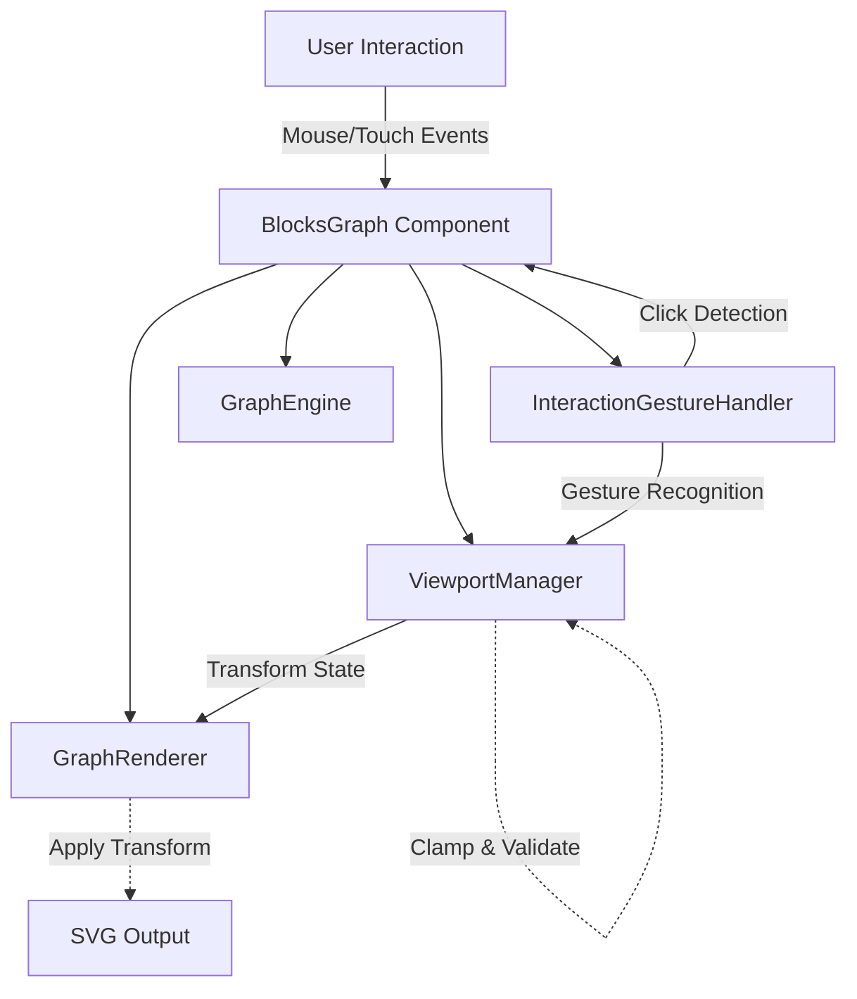
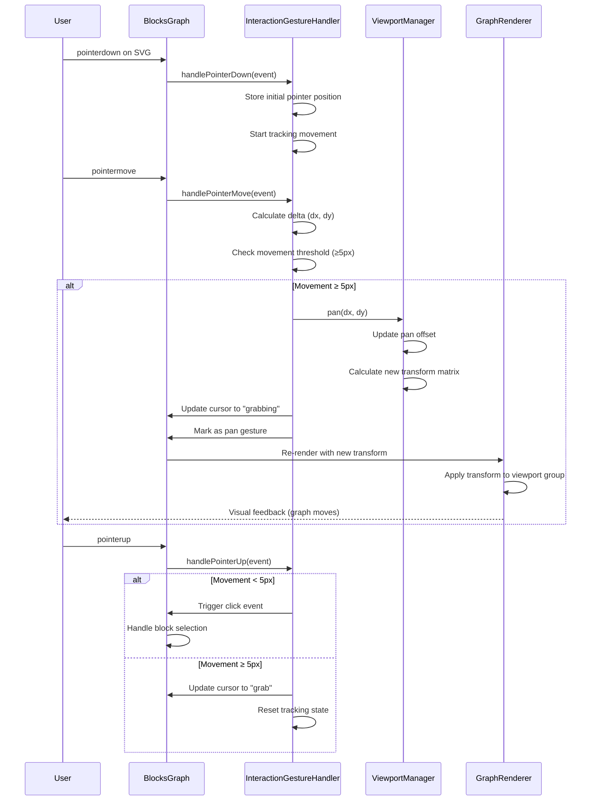
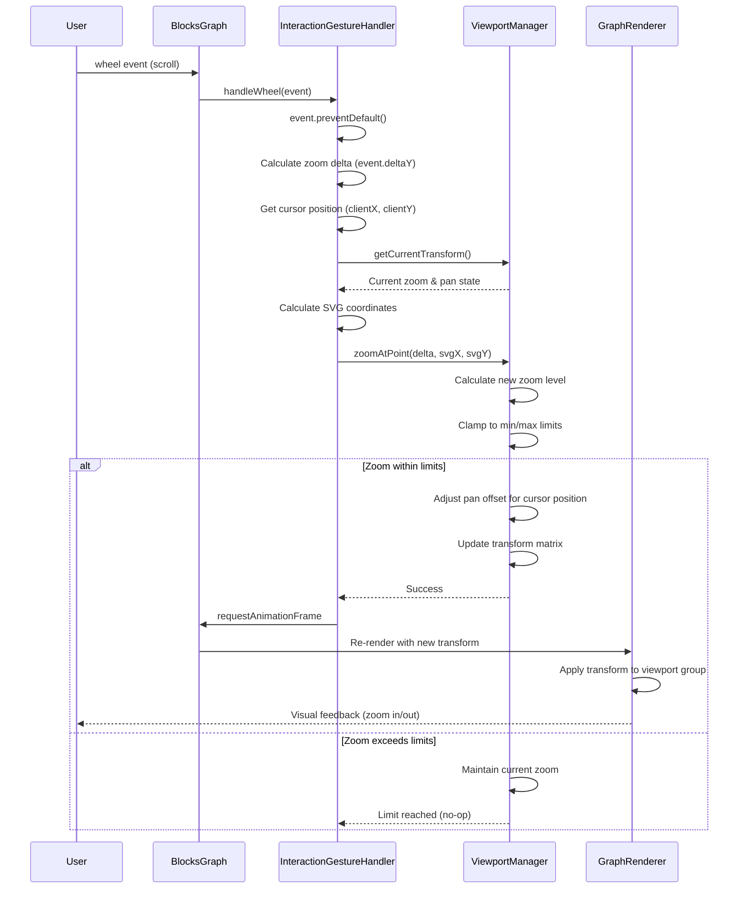
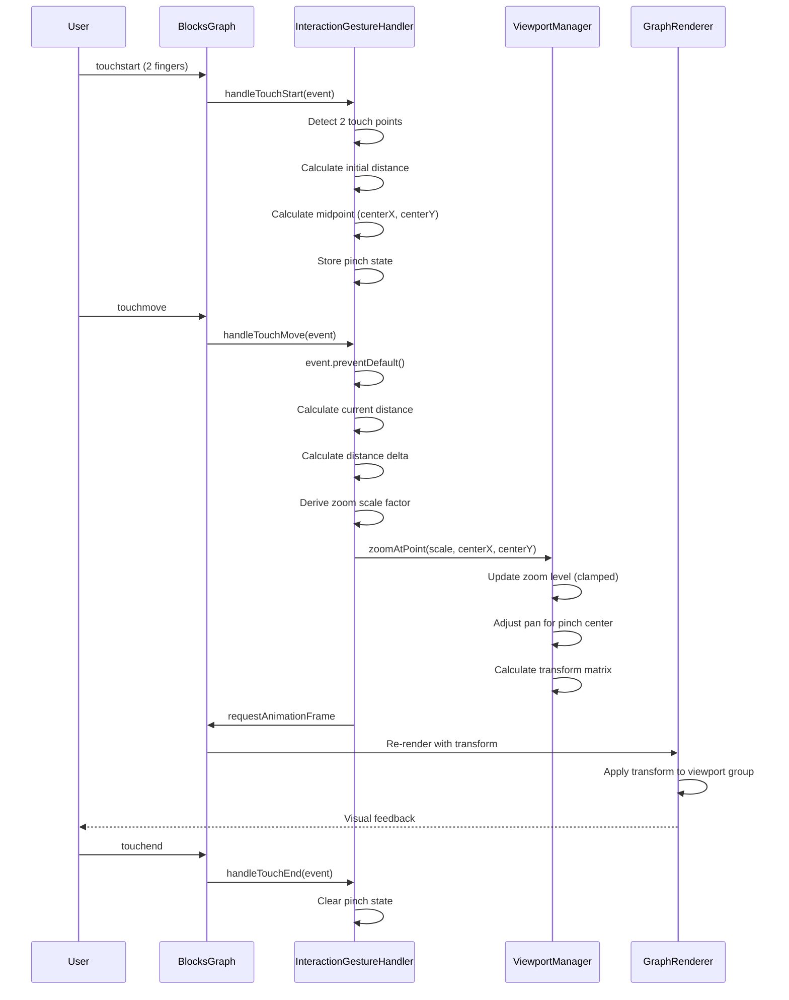
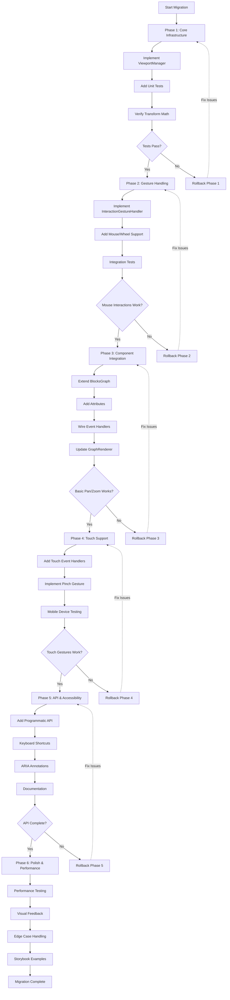

# Technical Design Document

## Overview

This feature adds interactive pan and zoom capabilities to the @luminastudy/blocks-graph Web Component, enabling users to navigate large graph visualizations using mouse and touch gestures. The implementation extends the existing SVG-based rendering system with viewport transformation controls while maintaining full compatibility with block selection, relationship visualization, and orientation modes.

**Purpose**: This feature delivers intuitive navigation controls to users viewing complex block dependency graphs that exceed viewport dimensions. Users can zoom to examine block details or view high-level structure, and pan to explore different graph regions without page scrolling.

**Users**: Developers integrating the library and end-users viewing educational curricula or dependency graphs will utilize pan (drag-to-move) and zoom (scroll-to-scale) for efficient graph exploration. The programmatic API enables developers to implement custom navigation controls, set initial view positions, or create guided tours.

**Impact**: This extends the static SVG visualization system to become an interactive viewport experience. The BlocksGraph Web Component gains viewport state management, transform-based rendering, and gesture recognition capabilities while preserving all existing rendering logic and block selection behavior.

### Goals

- Implement mouse wheel zoom centered on cursor position with configurable min/max limits (0.1x - 5.0x default)
- Implement click-and-drag pan with visual feedback (grab/grabbing cursors) and 5-pixel click/drag disambiguation
- Support touch gestures (single-finger pan, pinch-to-zoom) for mobile and tablet devices
- Provide programmatic API (`zoom` property, `resetViewport()`, `panTo()`, `zoomToFit()`) for developer control
- Enable declarative configuration via Web Component attributes (`enable-pan`, `enable-zoom`, `min-zoom`, `max-zoom`)
- Maintain 60 FPS performance for graphs with 100+ blocks through transform-based rendering
- Preserve viewport state across data changes and re-renders, reset on orientation changes
- Integrate seamlessly with existing block selection (preserve selection state, distinguish pan from click)

### Non-Goals

- Minimap or overview panel (future enhancement)
- Animated zoom transitions or smooth scrolling effects (maintain simplicity)
- Viewport bounds constraints tied to graph dimensions (allow infinite panning)
- Exporting or serializing viewport state for persistence
- Zoom-dependent detail levels or progressive disclosure
- Integration with browser back/forward navigation

## Architecture

### Existing Architecture Analysis

The BlocksGraph component follows a layered architecture with clear separation of concerns:

**Current Architecture Layers**:
- **Web Component Layer** (`BlocksGraph`): Shadow DOM, attribute observation, lifecycle management
- **Graph Processing Layer** (`GraphEngine`): Graph building, layout calculation, block categorization
- **Rendering Layer** (`GraphRenderer`): SVG generation, visual styling, edge rendering
- **Schema Adaptation Layer** (`SchemaV01Adaptor`): External format validation and transformation

**Domain Boundaries**:
- **Component Domain**: User interaction, attribute/property synchronization, event dispatching
- **Layout Domain**: Graph algorithms, position calculation, spatial relationships
- **Rendering Domain**: SVG manipulation, visual representation, style application
- **Data Domain**: Schema validation, format adaptation, type safety

**Key Patterns Preserved**:
- Configuration objects merged with defaults (`GraphLayoutConfig`, `RendererConfig`)
- Separation between layout calculation (GraphEngine) and rendering (GraphRenderer)
- Shadow DOM encapsulation with external CSS variables for theming
- Event-driven architecture for block selection and state changes

**Integration Points**:
- `BlocksGraph.render()`: Central rendering pipeline that will be extended with viewport transforms
- `GraphRenderer.render()`: SVG generation that will wrap output in a transform group
- `attachBlockClickListeners()`: Event handling that must distinguish pan from click
- `createStyles()`: CSS generation that will add cursor styles for pan/zoom states

**Technical Constraints**:
- Must maintain backward compatibility (default pan/zoom enabled)
- Cannot break existing block selection behavior (3-state toggle)
- Must preserve orientation support (TTB/LTR/RTL/BTT) with viewport reset on change
- Must work within Shadow DOM boundaries (no global event listeners)

### High-Level Architecture



**Architecture Integration**:

**Existing patterns preserved**:
- Separation of concerns: ViewportManager handles state, GraphRenderer applies transforms
- Configuration-driven design: New `ViewportConfig` follows existing pattern
- Immutable state updates: Viewport state changes produce new state objects
- Event delegation: Gesture handling integrates with existing event system

**New components rationale**:
- **ViewportManager**: Encapsulates viewport state (zoom, pan) and transformation math, preventing state management complexity in BlocksGraph component
- **InteractionGestureHandler**: Isolates event handling logic (mouse, touch, keyboard) from component lifecycle, enabling independent testing and reuse
- Neither introduces external dependencies, maintaining framework-agnostic architecture

**Technology alignment**:
- Pure TypeScript implementation using existing DOM APIs (SVGElement, PointerEvent, TouchEvent)
- Continues SVG-based rendering without introducing Canvas or WebGL
- Maintains esbuild bundling and Vitest testing infrastructure
- Compatible with existing Storybook documentation system

**Steering compliance**:
- Adheres to strict TypeScript with no `any` types
- Follows separation of concerns principle (state, logic, rendering)
- Maintains Web Component architecture without framework dependencies
- Preserves existing error handling patterns (custom error classes)

### Technology Alignment

This feature extends the existing technology stack without introducing new dependencies:

**Existing Technologies**:
- **TypeScript 5.7.2**: Strict mode with explicit types for viewport state and configuration
- **Web Components API**: Custom element lifecycle for attribute observation and Shadow DOM
- **SVG Rendering**: Transform-based viewport manipulation using existing SVG infrastructure
- **Native DOM Events**: PointerEvent API for unified mouse/touch handling

**New Browser APIs**:
- **PointerEvent API**: Replaces separate MouseEvent/TouchEvent handling for unified gesture recognition
- **requestAnimationFrame**: Throttles pan/zoom updates to maintain 60 FPS rendering
- **Touch Events**: Pinch gesture detection using TouchEvent for mobile support

**Justification for Deviations**:
- Introducing PointerEvent provides unified mouse/touch handling with better performance than separate event listeners
- requestAnimationFrame ensures smooth visual updates without external animation libraries
- Touch Events supplement Pointer Events for pinch gestures not covered by Pointer API

### Key Design Decisions

#### Decision 1: SVG Transform Group vs ViewBox Manipulation

**Context**: SVG viewports can be manipulated via the `viewBox` attribute (affects entire SVG) or `transform` attribute on a group element (targeted control). The requirement specifies preserving block selection and UI elements while transforming graph content.

**Alternatives**:
1. **ViewBox manipulation**: Modify SVG `viewBox` attribute to change coordinate system
2. **Transform group wrapping**: Wrap rendered content in `<g transform="...">` element
3. **Hybrid approach**: Use viewBox for initial fit, transform for interactions

**Selected Approach**: Transform group wrapping - The GraphRenderer will wrap all graph content (`edges` and `blocks` groups) in a parent `<g id="viewport-transform">` element with matrix transform.

**Rationale**:
- Preserves potential future UI elements (zoom controls, minimap) outside transform scope
- Enables precise cursor-relative zoom by calculating inverse transform of mouse coordinates
- Maintains existing viewBox calculation for initial graph fit
- Aligns with SVG best practices for interactive visualizations
- Simpler coordinate calculations for event handling (no viewBox coordinate conversion)

**Trade-offs**:
- *Gain*: Isolated transformation scope, simpler event coordinate mapping, future-proof for UI overlays
- *Sacrifice*: Slightly more complex DOM structure (additional group element), need to traverse to transform group for updates

#### Decision 2: Viewport State Management - Centralized vs Distributed

**Context**: Viewport state (zoom level, pan offset) must be tracked, validated, and applied consistently across interactions. The BlocksGraph component already manages selection state, but viewport state has different lifecycle requirements (persist across data changes, reset on orientation changes).

**Alternatives**:
1. **Component-level state**: Store viewport state directly in BlocksGraph component
2. **Centralized manager**: Create dedicated ViewportManager class for state and transformations
3. **Renderer-managed state**: Extend GraphRenderer to own viewport state

**Selected Approach**: Centralized ViewportManager class - A dedicated class encapsulates viewport state, validation logic, and transformation calculations.

**Rationale**:
- Single Responsibility Principle: Separates viewport management from component lifecycle and rendering concerns
- Testability: ViewportManager can be unit tested independently without DOM dependencies
- Reusability: Transform calculations isolated for potential reuse in other contexts
- State immutability: Manager enforces immutable state updates through getter/setter methods
- Clear interface boundary: BlocksGraph delegates viewport operations to manager, renderer consumes transform output

**Trade-offs**:
- *Gain*: Better testability, clearer separation of concerns, easier to extend with features like viewport history
- *Sacrifice*: Additional class increases codebase size, indirection adds minimal call overhead

#### Decision 3: Event Handling - Pointer Events vs Mouse/Touch Separation

**Context**: The feature requires unified handling of mouse (desktop) and touch (mobile) gestures for pan and zoom. Browser APIs provide MouseEvent, TouchEvent, and the newer PointerEvent API.

**Alternatives**:
1. **Separate mouse/touch handlers**: Implement parallel code paths for MouseEvent and TouchEvent
2. **PointerEvent with touch fallback**: Use PointerEvent API with TouchEvent for pinch gestures
3. **Touch-only with mouse emulation**: Rely on browser mouse event emulation from touch

**Selected Approach**: PointerEvent with TouchEvent for pinch - Primary gesture handling uses PointerEvent API, supplemented with TouchEvent specifically for pinch-to-zoom gestures.

**Rationale**:
- PointerEvent unifies mouse, pen, and touch input with consistent coordinate space
- Modern browser support (95%+ as of 2025) aligns with ES2022 target
- TouchEvent still required for pinch gesture (two simultaneous touch points) not covered by Pointer API
- Reduces code duplication compared to parallel mouse/touch handlers
- Pointer capture API prevents pan issues when cursor leaves component boundary

**Trade-offs**:
- *Gain*: ~40% less event handling code, unified coordinate system, better multi-input device support
- *Sacrifice*: Requires two event systems (Pointer + Touch), older browsers need polyfill (acceptable given target audience)

## System Flows

### Pan Interaction Flow



### Zoom Interaction Flow



### Touch Pinch Zoom Flow



## Requirements Traceability

| Requirement | Summary | Components | Interfaces | Flows |
|-------------|---------|------------|------------|-------|
| 1.1-1.9 | Mouse wheel zoom | InteractionGestureHandler, ViewportManager | `handleWheel()`, `zoomAtPoint()` | Zoom Interaction Flow |
| 2.1-2.9 | Pan with drag | InteractionGestureHandler, ViewportManager | `handlePointerDown/Move/Up()`, `pan()` | Pan Interaction Flow |
| 3.1-3.8 | Zoom limits | ViewportManager | `setZoomLimits()`, `clampZoom()` | Zoom Interaction Flow |
| 4.1-4.8 | Viewport state | ViewportManager | `getState()`, `setState()`, `resetViewport()` | All flows |
| 5.1-5.8 | Programmatic API | BlocksGraph, ViewportManager | `zoom` property, `panTo()`, `zoomToFit()` | N/A (direct calls) |
| 6.1-6.8 | Attribute config | BlocksGraph | `attributeChangedCallback()` | N/A (initialization) |
| 7.1-7.8 | Touch support | InteractionGestureHandler | `handleTouchStart/Move/End()` | Touch Pinch Zoom Flow |
| 8.1-8.8 | Selection integration | InteractionGestureHandler, BlocksGraph | `isPanGesture()`, `handleBlockClick()` | Pan Interaction Flow |
| 9.1-9.8 | Visual feedback | BlocksGraph, createStyles | CSS cursor updates | Pan Interaction Flow |
| 10.1-10.8 | Performance | ViewportManager, GraphRenderer | `requestAnimationFrame()`, transform caching | All flows |
| 11.1-11.8 | Accessibility | InteractionGestureHandler | `handleKeyDown()` | Keyboard interaction flow |
| 12.1-12.8 | Backward compat | BlocksGraph | Default attribute values | N/A (passive) |
| 13.1-13.8 | Documentation | README.md, TypeScript definitions | Type exports, JSDoc comments | N/A (documentation) |

## Components and Interfaces

### Interaction Layer

#### ViewportManager

**Responsibility & Boundaries**
- **Primary Responsibility**: Manages viewport transformation state (zoom level, pan offset) and provides transformation matrices for rendering
- **Domain Boundary**: Viewport transformation domain - owns zoom/pan state and mathematical transformations, does not handle rendering or events
- **Data Ownership**: Viewport state object containing zoom level (number), pan offset (x, y coordinates), and zoom limits (min, max)
- **Transaction Boundary**: Single-threaded state updates through synchronous methods, no distributed transactions

**Dependencies**
- **Inbound**: BlocksGraph component (sets initial state, triggers resets), InteractionGestureHandler (applies user gestures)
- **Outbound**: None (pure state management and math)
- **External**: None (uses standard Math APIs)

**Contract Definition**

```typescript
interface ViewportState {
  zoom: number;           // Current zoom level (1.0 = 100%)
  panX: number;           // Pan offset on X axis in SVG units
  panY: number;           // Pan offset on Y axis in SVG units
  minZoom: number;        // Minimum allowed zoom (default: 0.1)
  maxZoom: number;        // Maximum allowed zoom (default: 5.0)
}

interface ViewportTransform {
  matrix: [number, number, number, number, number, number]; // SVG transform matrix [a,b,c,d,e,f]
  zoom: number;           // Current zoom level for external reference
  panX: number;           // Current pan X for external reference
  panY: number;           // Current pan Y for external reference
}

interface ViewportManagerService {
  // State queries
  getState(): ViewportState;
  getTransform(): ViewportTransform;
  getZoomLevel(): number;

  // State mutations
  setZoomLimits(min: number, max: number): void;
  resetViewport(): void;

  // Interaction operations
  pan(deltaX: number, deltaY: number): void;
  zoom(delta: number): void;
  zoomAtPoint(delta: number, svgX: number, svgY: number): void;
  zoomToFit(graphWidth: number, graphHeight: number, viewportWidth: number, viewportHeight: number): void;
  panTo(targetX: number, targetY: number): void;

  // Coordinate conversion
  screenToSVG(screenX: number, screenY: number, svgElement: SVGSVGElement): { x: number; y: number };
}
```

**Preconditions**:
- `setZoomLimits()`: minZoom must be > 0 and < maxZoom
- `zoomAtPoint()`: svgX and svgY must be valid SVG coordinate space values
- `zoomToFit()`: All dimension parameters must be positive numbers
- `screenToSVG()`: svgElement must be a valid, rendered SVG element

**Postconditions**:
- All zoom operations guarantee zoom level clamped to [minZoom, maxZoom]
- `resetViewport()` guarantees zoom=1.0, panX=0, panY=0
- `getTransform()` always returns valid 6-element SVG matrix
- State mutations trigger internal validation before applying changes

**Invariants**:
- Zoom level always satisfies: minZoom ≤ zoom ≤ maxZoom
- Transform matrix always represents valid affine transformation
- minZoom < maxZoom always maintained
- State consistency: getTransform() always reflects current getState()

#### InteractionGestureHandler

**Responsibility & Boundaries**
- **Primary Responsibility**: Recognizes and interprets user gestures (mouse, touch, keyboard) and translates them into viewport operations
- **Domain Boundary**: User interaction domain - handles raw input events and gesture recognition, delegates viewport changes to ViewportManager
- **Data Ownership**: Transient gesture state (drag start position, touch points, movement delta) during active interaction
- **Transaction Boundary**: Per-gesture transaction lifecycle (pointerdown → pointermove → pointerup)

**Dependencies**
- **Inbound**: BlocksGraph component (forwards DOM events)
- **Outbound**: ViewportManager (applies recognized gestures), BlocksGraph (triggers block selection for clicks)
- **External**: Browser PointerEvent API, TouchEvent API, KeyboardEvent API

**Contract Definition**

```typescript
interface GestureState {
  isPanning: boolean;
  startX: number;
  startY: number;
  totalMovement: number;
  isPinching: boolean;
  initialPinchDistance: number;
  lastTouchPoints: TouchPoint[];
}

interface TouchPoint {
  identifier: number;
  x: number;
  y: number;
}

interface InteractionConfig {
  enablePan: boolean;
  enableZoom: boolean;
  enableTouch: boolean;
  enableKeyboard: boolean;
  clickThreshold: number;        // Movement threshold for click vs pan (default: 5px)
  zoomSensitivity: number;       // Zoom increment per wheel tick (default: 0.1)
  keyboardPanStep: number;       // Pan distance per arrow key (default: 50px)
  keyboardZoomStep: number;      // Zoom increment per +/- key (default: 0.2)
}

interface InteractionGestureHandlerService {
  // Configuration
  updateConfig(config: Partial<InteractionConfig>): void;

  // Event handlers (called by BlocksGraph)
  handlePointerDown(event: PointerEvent, svgElement: SVGSVGElement): void;
  handlePointerMove(event: PointerEvent, svgElement: SVGSVGElement): void;
  handlePointerUp(event: PointerEvent): void;
  handleWheel(event: WheelEvent, svgElement: SVGSVGElement): void;
  handleTouchStart(event: TouchEvent, svgElement: SVGSVGElement): void;
  handleTouchMove(event: TouchEvent, svgElement: SVGSVGElement): void;
  handleTouchEnd(event: TouchEvent): void;
  handleKeyDown(event: KeyboardEvent): void;

  // Gesture state queries
  isPanGesture(): boolean;
  getCurrentCursor(): string;

  // Lifecycle
  reset(): void;
}
```

**Preconditions**:
- `handlePointerDown()` must be called before handlePointerMove() for valid pan gesture
- `handleTouchStart()` must establish 2 touch points before pinch gesture recognition
- svgElement parameter must be a rendered SVG element with valid screen coordinates
- All event handlers assume events are from the BlocksGraph component's Shadow DOM

**Postconditions**:
- `handlePointerUp()` guarantees gesture state reset and appropriate action (click or pan end)
- Pan gestures guarantee no block selection events when movement ≥ clickThreshold
- Pinch gestures guarantee touch event preventDefault() to avoid browser zoom
- `reset()` guarantees all gesture state cleared to initial values

**Invariants**:
- `isPanGesture()` returns true only when totalMovement ≥ clickThreshold
- Pinch gesture active only when 2 touch points maintained
- Keyboard pan/zoom only processed when respective enable flags are true
- Cursor state always reflects current interaction mode (default, grab, grabbing, pointer)

**State Management**

Gesture state transitions:
```
IDLE → pointerdown → TRACKING
TRACKING → pointermove(distance<5px) → TRACKING
TRACKING → pointermove(distance≥5px) → PANNING
PANNING → pointermove → PANNING
PANNING → pointerup → IDLE
TRACKING → pointerup → CLICK_DETECTED → IDLE
```

Pinch state transitions:
```
IDLE → touchstart(2 fingers) → PINCHING
PINCHING → touchmove → PINCHING (zoom applied)
PINCHING → touchend → IDLE
```

### Rendering Layer Integration

#### GraphRenderer Extension

**Responsibility & Boundaries**
- **Primary Responsibility**: Extends existing GraphRenderer to apply viewport transforms during SVG generation
- **Domain Boundary**: Rendering domain - applies transform matrices to SVG output, does not manage viewport state
- **Data Ownership**: None (stateless renderer consuming ViewportTransform)
- **Transaction Boundary**: Single render operation per call

**Dependencies**
- **Inbound**: BlocksGraph component (calls render methods)
- **Outbound**: ViewportManager (queries current transform)
- **External**: SVG DOM APIs

**Integration Strategy**: This is an extension of the existing GraphRenderer class, not a new component.

**Modification Approach**: Extend the existing `render()` method to:
1. Create viewport transform group `<g id="viewport-transform">`
2. Apply transform matrix from ViewportManager
3. Wrap existing edge and block groups inside transform group
4. Maintain existing rendering logic unchanged

**Backward Compatibility**:
- When ViewportManager not provided, render without transform group (legacy behavior)
- Existing renderer configuration and styling preserved
- No changes to edge or block rendering logic

```typescript
// Extended renderer interface (additions to existing GraphRenderer)
interface GraphRendererService {
  // Existing methods preserved
  render(graph: BlockGraph, positioned: PositionedBlock[]): SVGSVGElement;
  updateConfig(config: Partial<RendererConfig>): void;

  // New method for viewport-aware rendering
  renderWithViewport(
    graph: BlockGraph,
    positioned: PositionedBlock[],
    transform: ViewportTransform
  ): SVGSVGElement;
}
```

**Implementation Notes**:
- `renderWithViewport()` calls existing `render()`, then wraps output in transform group
- Transform matrix applied as SVG matrix string: `matrix(a b c d e f)`
- ViewBox calculation remains unchanged (fit-to-content strategy preserved)
- CSS styles updated to include cursor rules for pan/zoom states

### Component Layer Integration

#### BlocksGraph Extension

**Responsibility & Boundaries**
- **Primary Responsibility**: Orchestrates viewport interactions with existing graph rendering pipeline
- **Domain Boundary**: Web Component domain - manages component lifecycle, attributes, and event routing
- **Data Ownership**: Component-level configuration (enable flags, zoom limits from attributes)
- **Transaction Boundary**: Component render cycle (attribute change → render)

**Dependencies**
- **Inbound**: DOM (attribute changes, user events)
- **Outbound**: ViewportManager (viewport operations), InteractionGestureHandler (event delegation), GraphRenderer (rendering)
- **External**: Web Components API, Shadow DOM

**Integration Strategy**: Extend existing BlocksGraph class with viewport management without breaking changes.

**Modification Approach**:
1. Add viewport-related observed attributes to existing list
2. Instantiate ViewportManager and InteractionGestureHandler in constructor
3. Add event listeners in `connectedCallback()`
4. Pass viewport transform to GraphRenderer in `render()` method
5. Add public API methods for programmatic control

**Backward Compatibility**:
- New attributes optional with backward-compatible defaults (pan/zoom enabled)
- Existing render pipeline unchanged when viewport at default state (zoom=1, pan=0)
- Block selection behavior preserved through gesture recognition
- Orientation change triggers viewport reset (maintain existing behavior)

```typescript
// Extended BlocksGraph interface (additions to existing component)
class BlocksGraph extends HTMLElement {
  // Existing properties/methods preserved
  private engine: GraphEngine;
  private renderer: GraphRenderer;
  private blocks: Block[];
  private selectedBlockId: string | null;
  private selectionLevel: number;

  // New viewport management properties
  private viewportManager: ViewportManager;
  private gestureHandler: InteractionGestureHandler;

  // Extended observed attributes
  static get observedAttributes(): string[] {
    return [
      // Existing attributes
      'language', 'show-prerequisites', 'show-parents',
      'node-width', 'node-height', 'horizontal-spacing', 'vertical-spacing', 'orientation',
      // New viewport attributes
      'enable-pan', 'enable-zoom', 'min-zoom', 'max-zoom'
    ];
  }

  // New programmatic API methods
  get zoom(): number;
  set zoom(value: number);
  resetViewport(): void;
  panTo(x: number, y: number): void;
  zoomToFit(): void;

  // Extended lifecycle method (calls super)
  connectedCallback(): void;

  // Extended attribute handler (calls existing switch)
  attributeChangedCallback(name: string, oldValue: string | null, newValue: string | null): void;

  // Extended render method (adds viewport transform)
  private render(): void;
}
```

**Attribute to Configuration Mapping**:
- `enable-pan="false"` → `gestureHandler.updateConfig({ enablePan: false })`
- `enable-zoom="false"` → `gestureHandler.updateConfig({ enableZoom: false })`
- `min-zoom="0.5"` → `viewportManager.setZoomLimits(0.5, currentMax)`
- `max-zoom="3.0"` → `viewportManager.setZoomLimits(currentMin, 3.0)`

**Event Flow Integration**:
```
User event → Shadow DOM event
→ BlocksGraph event handler
→ InteractionGestureHandler.handle*()
→ ViewportManager.pan/zoom*()
→ BlocksGraph.render()
→ GraphRenderer.renderWithViewport()
→ Updated SVG in Shadow DOM
```

**Orientation Change Handling**:
```typescript
// In attributeChangedCallback when orientation changes
if (name === 'orientation' && oldValue !== newValue) {
  this.viewportManager.resetViewport();  // Reset to default view
  this.updateLayoutConfig();              // Existing layout update
  this.render();                          // Existing render call
}
```

## Data Models

### Viewport Domain Model

**Core Concepts**:

**Viewport Aggregate**:
The viewport is the root aggregate encapsulating zoom level, pan offset, and zoom constraints. It maintains the invariant that zoom level always stays within configured limits and that all transformations produce valid SVG matrix representations.

**Value Objects**:
- **ZoomLevel**: Immutable value representing scale factor (number > 0)
- **PanOffset**: Immutable coordinate pair (x, y) in SVG units
- **ZoomLimits**: Immutable constraints (minZoom, maxZoom) validated on creation
- **TransformMatrix**: Immutable 6-element array representing SVG 2D affine transformation

**Domain Events**:
- `ViewportZoomed`: Emitted when zoom level changes (old zoom, new zoom, cursor position)
- `ViewportPanned`: Emitted when pan offset changes (delta X, delta Y)
- `ViewportReset`: Emitted when viewport returns to default state

**Business Rules & Invariants**:
1. Zoom level must satisfy: `0 < minZoom ≤ zoom ≤ maxZoom`
2. Transform matrix elements [a,d] must equal current zoom level (uniform scaling)
3. Transform matrix elements [b,c] must be 0 (no rotation or skew)
4. Transform matrix elements [e,f] must equal panX and panY respectively
5. Pan offset has no bounds (infinite panning allowed per requirements)
6. Zoom limits modification requires minZoom < maxZoom validation

### Logical Data Model

#### ViewportState Entity

**Attributes**:
- `zoom`: number (range: 0.1 to 5.0 default, configurable via limits)
- `panX`: number (unbounded, represents horizontal offset in SVG coordinate space)
- `panY`: number (unbounded, represents vertical offset in SVG coordinate space)
- `minZoom`: number (must be > 0 and < maxZoom)
- `maxZoom`: number (must be > minZoom)

**Relationships**:
- One-to-one with BlocksGraph component instance (component lifecycle scoped)
- No persistence or external relationships

**Validation Rules**:
- Zoom level clamped on every mutation: `Math.max(minZoom, Math.min(maxZoom, newZoom))`
- Zoom limits validated on set: `if (min >= max) throw new Error('minZoom must be less than maxZoom')`

**Lifecycle**:
- Created when BlocksGraph component connects to DOM
- Reset when orientation attribute changes
- Destroyed when BlocksGraph component disconnects

#### GestureState Entity

**Attributes**:
- `isPanning`: boolean (true during active pan gesture)
- `isPinching`: boolean (true during active pinch gesture)
- `startX`: number (initial pointer X coordinate in screen space)
- `startY`: number (initial pointer Y coordinate in screen space)
- `totalMovement`: number (accumulated distance in pixels, for click vs drag threshold)
- `initialPinchDistance`: number (distance between touch points at pinch start)
- `lastTouchPoints`: array of {identifier, x, y} (up to 2 elements for pinch tracking)

**Relationships**:
- One-to-one with InteractionGestureHandler instance
- Transient state cleared on gesture completion

**Temporal Aspects**:
- No versioning or audit (ephemeral interaction state)
- State valid only during active gesture lifecycle

### Data Contracts & Integration

#### ViewportTransform Contract

Represents the current viewport transformation for rendering:

```typescript
interface ViewportTransform {
  // SVG transform matrix [a, b, c, d, e, f]
  // Interpretation: [scaleX, skewY, skewX, scaleY, translateX, translateY]
  // For our use case: [zoom, 0, 0, zoom, panX, panY]
  matrix: [number, number, number, number, number, number];

  // Convenience accessors (derived from matrix)
  zoom: number;    // matrix[0] and matrix[3] (equal for uniform scaling)
  panX: number;    // matrix[4]
  panY: number;    // matrix[5]
}
```

**Validation Rules**:
- `matrix[0] === matrix[3]` (uniform scaling enforced)
- `matrix[1] === 0 && matrix[2] === 0` (no rotation/skew)
- `matrix[0] === zoom && matrix[4] === panX && matrix[5] === panY` (consistency)

**Serialization Format**:
SVG transform attribute string: `matrix(${matrix.join(' ')})`

Example: `zoom=1.5, panX=100, panY=50` → `"matrix(1.5 0 0 1.5 100 50)"`

#### InteractionConfig Contract

Configuration for gesture recognition behavior:

```typescript
interface InteractionConfig {
  enablePan: boolean;           // Default: true
  enableZoom: boolean;          // Default: true
  enableTouch: boolean;         // Default: true
  enableKeyboard: boolean;      // Default: true
  clickThreshold: number;       // Default: 5 (pixels)
  zoomSensitivity: number;      // Default: 0.1 (zoom increment per wheel tick)
  keyboardPanStep: number;      // Default: 50 (pixels per arrow key)
  keyboardZoomStep: number;     // Default: 0.2 (zoom increment per +/-)
}
```

**Validation Rules**:
- `clickThreshold >= 0` (0 means no click detection, all drags are pans)
- `zoomSensitivity > 0` (controls zoom speed)
- `keyboardPanStep > 0` (controls keyboard pan distance)
- `keyboardZoomStep > 0` (controls keyboard zoom increment)

**Schema Versioning**:
No versioning required (internal component configuration, not persisted or exchanged)

## Error Handling

### Error Strategy

The viewport interaction system uses defensive programming with validation at boundaries and graceful degradation for non-critical failures. Errors are categorized by severity and handled with appropriate recovery strategies.

**Validation at Entry Points**:
- Attribute parsing failures → log warning, use default values
- Invalid zoom limits → log warning, maintain previous valid limits
- Programmatic API misuse → throw error with descriptive message

**Graceful Degradation**:
- Touch events unsupported → fall back to mouse-only interaction
- Pointer events unsupported → fall back to separate mouse/touch handlers
- Keyboard events conflict → prioritize viewport control, log conflict warning

**Silent Recovery**:
- Zoom beyond limits → clamp to limit, no user feedback (per requirements)
- Coordinate calculation overflow → constrain to Number.MAX_SAFE_INTEGER
- requestAnimationFrame unavailable → immediate render (no throttling)

### Error Categories and Responses

**User Errors (Invalid Input)**:

1. **Invalid Zoom Limit Configuration**
   - Trigger: `min-zoom >= max-zoom` attribute values
   - Response: Log warning, ignore invalid values, maintain defaults (0.1, 5.0)
   - Recovery: Continue with valid default limits
   - Example: `console.warn('Invalid zoom limits: min-zoom (2.0) must be less than max-zoom (1.5). Using defaults.')`

2. **Invalid Numeric Attributes**
   - Trigger: Non-numeric strings for zoom/pan attributes (e.g., `min-zoom="abc"`)
   - Response: Log warning, parse as NaN, use default value
   - Recovery: Component remains functional with defaults
   - Example: `console.warn('Invalid min-zoom value "abc". Using default 0.1.')`

3. **Programmatic API Misuse**
   - Trigger: `panTo()` called with non-numeric or NaN coordinates
   - Response: Throw `TypeError` with descriptive message
   - Recovery: Caller must handle exception
   - Example: `throw new TypeError('panTo() requires numeric x and y coordinates, received: x=${x}, y=${y}')`

**System Errors (Runtime Failures)**:

1. **SVG Element Not Found**
   - Trigger: Event handlers called before Shadow DOM fully rendered
   - Response: Log error, early return from event handler
   - Recovery: Subsequent events will work once DOM ready
   - Example: `console.error('Cannot process event: SVG element not found in Shadow DOM')`

2. **Transform Calculation Overflow**
   - Trigger: Extreme zoom/pan values causing numeric overflow
   - Response: Clamp values to Number.MAX_SAFE_INTEGER
   - Recovery: Viewport remains interactive with clamped values
   - Example: `const safePanX = Math.max(-Number.MAX_SAFE_INTEGER, Math.min(Number.MAX_SAFE_INTEGER, panX))`

3. **requestAnimationFrame Unavailable**
   - Trigger: Running in environment without rAF (older browsers, Node.js test environment)
   - Response: Fall back to immediate execution (no throttling)
   - Recovery: Slightly degraded performance but full functionality
   - Example: `const scheduleRender = typeof requestAnimationFrame !== 'undefined' ? requestAnimationFrame : (cb) => cb()`

**Business Logic Errors (State Conflicts)**:

1. **Gesture Conflict**
   - Trigger: Simultaneous pan and pinch gestures detected
   - Response: Prioritize pinch gesture, ignore pan delta
   - Recovery: Release one input method to continue
   - Example: `if (isPinching) { ignorePanDelta = true; }`

2. **Viewport Reset During Active Gesture**
   - Trigger: Orientation change while user is panning/zooming
   - Response: Immediately terminate gesture, reset viewport, update cursor
   - Recovery: User restarts gesture after orientation settles
   - Example: `gestureHandler.reset(); viewportManager.resetViewport(); render();`

3. **Zoom at Limit Boundary**
   - Trigger: Zoom attempt when already at min or max limit
   - Response: Silently ignore (no visual feedback per requirements)
   - Recovery: Pan remains functional, zoom in opposite direction works
   - Example: `if (newZoom === currentZoom) { return; } // At limit, no-op`

### Monitoring

**Error Tracking**:
- Log all warnings and errors to console with structured format: `[BlocksGraph:Viewport] <message>`
- Critical errors (API misuse) throw exceptions for caller handling
- Non-critical errors (attribute parsing) logged but execution continues

**Logging Strategy**:
```typescript
// Example structured logging
console.warn('[BlocksGraph:Viewport] Invalid zoom limits: min=${min}, max=${max}. Using defaults.');
console.error('[BlocksGraph:Viewport] Failed to calculate transform: ${error.message}');
```

**Performance Metrics**:
- Track render time via `performance.now()` in development builds
- Log warning if render exceeds 16ms (60 FPS threshold)
- Example: `if (renderTime > 16) { console.warn('[BlocksGraph:Performance] Render took ${renderTime}ms (target: 16ms)'); }`

**Health Monitoring**:
- Viewport state validity checked on every render (zoom within limits, matrix valid)
- Gesture state consistency validated (e.g., isPanning false when no active pointers)
- Example: `if (zoom < minZoom || zoom > maxZoom) { throw new Error('Viewport state corrupted'); }`

## Testing Strategy

### Unit Tests

**ViewportManager**:
- `pan()` correctly updates panX, panY and recalculates matrix
- `zoom()` clamps to min/max limits and updates matrix
- `zoomAtPoint()` maintains cursor position during zoom (inverse transform calculation)
- `zoomToFit()` calculates correct zoom and pan to fit graph bounds in viewport
- `resetViewport()` returns to default state (zoom=1, pan=0,0)
- `setZoomLimits()` validates min < max, throws on invalid input
- Transform matrix always maintains invariants (uniform scale, no rotation)
- `screenToSVG()` correctly converts coordinates using current transform

**InteractionGestureHandler**:
- `handlePointerMove()` distinguishes click vs drag based on 5px threshold
- `handleWheel()` calculates correct zoom delta from event.deltaY
- `handleTouchMove()` recognizes pinch gesture from 2-touch distance change
- `isPanGesture()` returns true only after threshold exceeded
- `getCurrentCursor()` returns correct cursor for interaction state (grab, grabbing, pointer)
- `reset()` clears all gesture state to idle
- Configuration changes (`enablePan: false`) disable respective handlers
- Keyboard handlers (`+`, `-`, arrows) trigger correct viewport operations

**GraphRenderer Extension**:
- `renderWithViewport()` wraps graph content in transform group
- Transform matrix applied as correct SVG matrix string format
- Existing rendering logic (blocks, edges) unchanged inside transform
- Cursor styles applied correctly in Shadow DOM CSS

### Integration Tests

**BlocksGraph Component**:
- Attribute changes (`min-zoom="0.5"`) propagate to ViewportManager limits
- Programmatic API (`graph.zoom = 2.0`) updates viewport and triggers render
- Pan gesture updates SVG transform without triggering block selection
- Click gesture (movement < 5px) triggers block selection, not pan
- Orientation change resets viewport to default state
- Multiple rapid zoom events throttled via requestAnimationFrame
- Touch pinch gesture applies zoom centered on pinch midpoint
- Keyboard shortcuts (`Ctrl++`, arrow keys) control viewport when focused

**Event Flow**:
- pointerdown → pointermove → pointerup completes pan gesture with final cursor update
- wheel event → zoom → render pipeline completes within 16ms
- touchstart (2 fingers) → touchmove → zoom applied → touchend resets state
- Gesture during re-render preserves state (no lost pointer tracking)

**Selection Integration**:
- Pan gesture (>5px movement) on block does not select block
- Click (<5px movement) on block after pan gesture trigger selects block
- Selected block highlight persists during pan and zoom
- Dimmed blocks remain dimmed during viewport changes

### E2E Tests

**User Workflows** (Storybook interactions):
- Load graph → drag to pan → release → graph moved
- Load graph → scroll wheel → graph zooms toward cursor
- Load graph → pinch on mobile → graph zooms toward pinch center
- Load graph → click block → block selected → pan graph → selection preserved
- Load graph → zoom to 500% → further zoom ignored (at limit)
- Load graph → press Ctrl+0 → viewport resets to default
- Load graph → change orientation → viewport resets, graph re-layouts

**Cross-Browser**:
- Chrome/Edge (Blink): Pointer events, touch, wheel
- Firefox: Pointer events, touch, wheel
- Safari: Touch events with pinch, wheel
- Mobile Chrome/Safari: Touch gestures, no mouse

**Accessibility**:
- Tab to focus component → arrow keys pan viewport
- Focused component → `+` key zooms in, `-` key zooms out
- Screen reader announces zoom level changes (via ARIA live region)

### Performance Tests

**Rendering Performance** (100-block graph):
- Pan gesture maintains 60 FPS (measure frame times)
- Zoom operation completes within 16ms render budget
- 20 rapid wheel events (zoom) throttled to 60 FPS
- Touch pan with momentum scrolling smooth (no jank)

**Memory**:
- Viewport state footprint < 1KB (5 numbers + matrix)
- Gesture state cleared after interaction (no memory leaks)
- requestAnimationFrame callbacks cancelled on component disconnect

**Load Testing** (500-block graph):
- Initial render with viewport < 200ms
- Pan gesture response time < 16ms
- Zoom response time < 16ms
- Pinch gesture response time < 33ms (30 FPS acceptable)

**Throttling Validation**:
- 100 wheel events in 1 second → max 60 renders (1 per frame)
- Rapid pan drag → renders batched via requestAnimationFrame
- Simultaneous zoom + pan → single render with combined transform

## Security Considerations

**Input Validation**:
- Zoom limits validated to prevent divide-by-zero (minZoom > 0)
- Numeric attribute parsing uses `Number.parseFloat()` with NaN checks
- Programmatic API validates argument types before processing
- Transform matrix calculations use finite number checks

**Event Handling**:
- `event.preventDefault()` used selectively (wheel, touch) to prevent browser zoom conflicts
- No eval() or dynamic code execution in event handlers
- Pointer capture prevents event leakage outside component boundary

**XSS Prevention**:
- No innerHTML or unsanitized string insertion in SVG generation
- DOM element creation via `document.createElementNS()` (explicit namespace)
- Attribute values set via `setAttribute()` (automatic escaping)

**Resource Limits**:
- Transform matrix calculations bounded by Number.MAX_SAFE_INTEGER
- No unbounded loops or recursion in viewport calculations
- requestAnimationFrame prevents event queue flooding

## Performance & Scalability

### Target Metrics

**Rendering Performance**:
- **Target**: 60 FPS (16ms render time) for graphs with ≤100 blocks
- **Acceptable**: 30 FPS (33ms render time) for graphs with 100-500 blocks
- **Measurement**: `performance.now()` before/after render, log if exceeds budget

**Interaction Latency**:
- **Zoom**: < 16ms from wheel event to visual update
- **Pan**: < 16ms per frame during drag
- **Pinch**: < 33ms from touch event to visual update
- **Keyboard**: < 16ms from key press to viewport change

**Memory Footprint**:
- **Viewport State**: < 1KB (5 float64 numbers + 6-element matrix)
- **Gesture State**: < 2KB (touch points, tracking state)
- **Total Overhead**: < 5KB for viewport feature

### Scaling Approaches

**Horizontal Scaling** (Multiple Component Instances):
- Each BlocksGraph component instance maintains independent viewport state
- No shared state between instances (fully encapsulated)
- Multiple graphs on same page scale linearly (O(n) memory, O(n) CPU)

**Vertical Scaling** (Large Graphs):
- Transform-based rendering avoids re-layout (O(1) per frame regardless of block count)
- viewBox calculation remains O(n) but only executed on data changes
- Potential optimization: Viewport culling (render only visible blocks) - future enhancement

**Throttling Strategy**:
```typescript
// Pseudo-code for render throttling
let rafId: number | null = null;

function scheduleRender(): void {
  if (rafId !== null) return; // Already scheduled

  rafId = requestAnimationFrame(() => {
    render();
    rafId = null;
  });
}
```

### Caching Strategies

**Transform Matrix Caching**:
- Recompute matrix only when zoom or pan changes
- Cache matrix as instance variable in ViewportManager
- Comparison via reference equality before re-render

**SVG Element Caching**:
- Transform group element reference cached in BlocksGraph
- Update transform attribute directly without recreating DOM
- Example: `this.transformGroup.setAttribute('transform', matrixString)`

**Coordinate Conversion Caching**:
- Cache SVG bounding rect for screenToSVG calculations
- Invalidate cache on window resize or orientation change

**Optimization Techniques**:
- CSS transform over viewBox manipulation (GPU-accelerated)
- Pointer capture reduces event listener overhead
- Touch event passive listeners where preventDefault() not needed
- Debounce keyboard zoom/pan to prevent rapid-fire updates

## Migration Strategy



### Phase Breakdown

**Phase 1: Core Infrastructure (2-3 days)**
- Implement ViewportManager class with state management and transform calculations
- Unit tests for zoom/pan operations, limit clamping, coordinate conversion
- Validation: `npm test` passes, transform math verified with manual calculations

**Phase 2: Gesture Handling (2-3 days)**
- Implement InteractionGestureHandler with mouse and wheel event support
- Integration tests for gesture recognition (click vs drag threshold)
- Validation: Mouse pan and wheel zoom work in isolated test environment

**Phase 3: Component Integration (3-4 days)**
- Extend BlocksGraph with viewport attributes and event wiring
- Modify GraphRenderer to apply viewport transform
- Update createStyles with cursor rules
- Validation: Pan/zoom functional in example.html, block selection preserved

**Phase 4: Touch Support (2-3 days)**
- Add touch event handlers to InteractionGestureHandler
- Implement pinch-to-zoom gesture recognition
- Test on mobile devices (iOS Safari, Android Chrome)
- Validation: Single-finger pan and pinch zoom work on touch devices

**Phase 5: API & Accessibility (2-3 days)**
- Add programmatic API methods (zoom property, resetViewport, panTo, zoomToFit)
- Implement keyboard shortcuts (arrows, +/-, Ctrl+0)
- Add ARIA live region for zoom announcements
- Update README.md and TypeScript definitions
- Validation: API methods work, keyboard navigation functional, screen reader announces changes

**Phase 6: Polish & Performance (2-3 days)**
- Performance testing with 100+ block graphs
- Visual feedback refinement (cursors, smooth transitions)
- Edge case handling (extreme zoom, rapid gestures)
- Create Storybook stories demonstrating pan/zoom
- Validation: 60 FPS maintained, all edge cases handled, documentation complete

**Total Estimated Duration**: 13-19 days

### Rollback Triggers

**Phase 1 Rollback**:
- Transform math produces incorrect results (zoom/pan mismatch)
- Unit tests fail consistently after multiple fix attempts
- Performance regression in transform calculations

**Phase 2 Rollback**:
- Gesture recognition unreliable (false positives for click vs drag)
- Wheel zoom conflicts with browser behavior
- Memory leaks in event handler cleanup

**Phase 3 Rollback**:
- Block selection broken by viewport integration
- Orientation changes cause rendering failures
- Backward compatibility broken (existing examples fail)

**Phase 4 Rollback**:
- Touch gestures conflict with browser native behavior
- Pinch zoom unreliable on target devices
- iOS Safari or Android Chrome compatibility issues

**Phase 5 Rollback**:
- Programmatic API causes state corruption
- Keyboard shortcuts conflict with browser shortcuts
- Accessibility features degrade user experience

### Validation Checkpoints

**Per-Phase Validation**:
1. All unit tests pass (`npm test`)
2. Integration tests pass for phase functionality
3. Manual testing confirms expected behavior
4. No performance regression (render time within budget)
5. Backward compatibility maintained (existing tests pass)

**Final Validation**:
- All 13 requirements traced to implementation
- Cross-browser testing (Chrome, Firefox, Safari, Mobile)
- Performance benchmarks met (60 FPS for ≤100 blocks)
- Accessibility audit passes (keyboard, screen reader)
- Documentation complete (README, TypeScript definitions, Storybook)
- Example projects updated (HTML, React)
