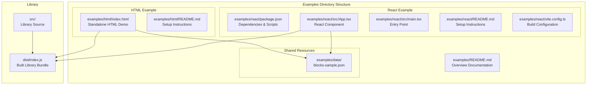
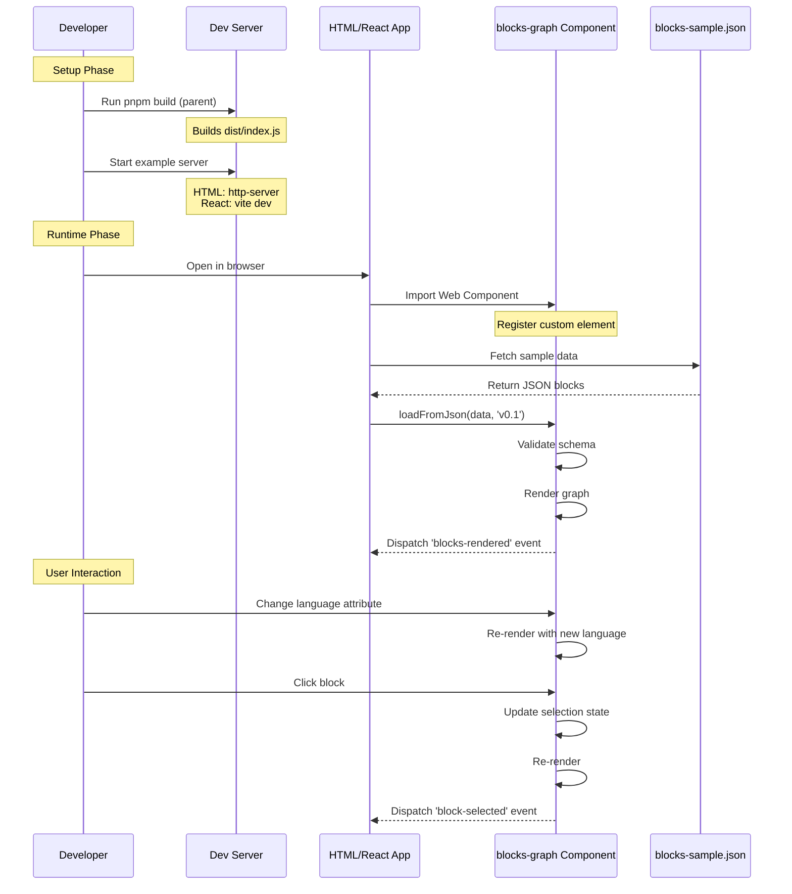
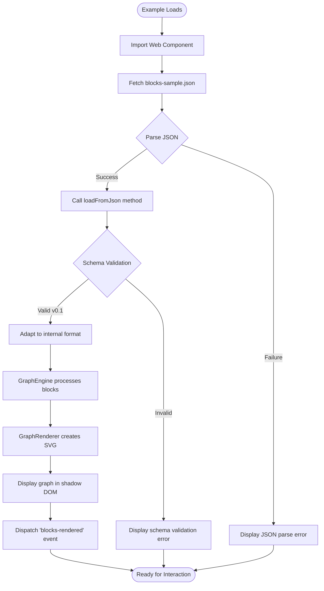
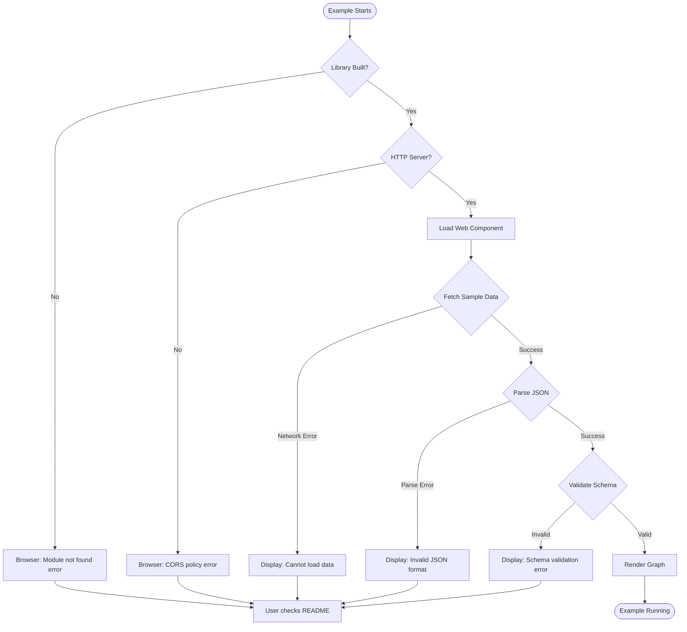
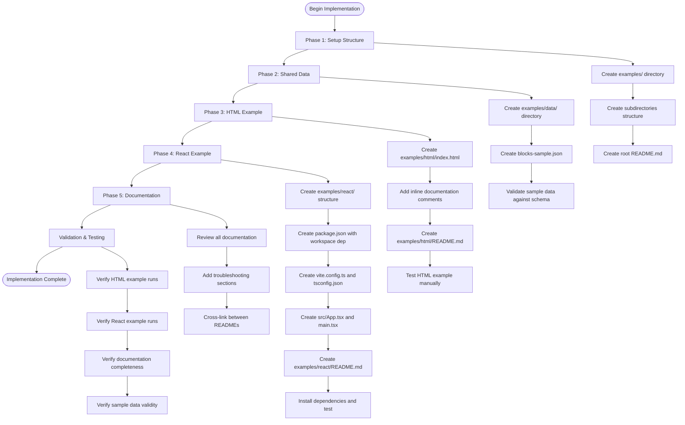

# Technical Design Document

## Overview

This feature creates runnable example applications demonstrating the integration of the @lumina-study/blocks-graph Web Component in both pure HTML and React contexts. The examples serve as executable documentation and validation that the library works correctly across different integration patterns.

**Purpose**: This feature delivers working reference implementations to developers integrating the blocks-graph library, reducing onboarding time and providing validation of cross-framework compatibility.

**Users**: Library consumers (frontend developers) will utilize these examples to understand integration patterns, API usage, and best practices when incorporating the Web Component into their HTML or React applications.

**Impact**: This extends the existing library by adding a structured examples directory without modifying the core library code. The examples reference the built library artifacts from the `dist/` directory, maintaining a clean separation between library code and demonstration code.

### Goals

- Provide immediately runnable examples in both pure HTML and React contexts
- Demonstrate core library features including component registration, data loading, and attribute configuration
- Establish a foundation for future framework examples (Vue, Angular, etc.)
- Validate library compatibility across integration patterns
- Serve as living documentation that stays synchronized with library API changes

### Non-Goals

- Building a comprehensive example gallery covering all possible configurations
- Creating production-ready applications or starter templates
- Adding framework adaptor wrappers or framework-specific abstractions
- Modifying the core library code or API
- Publishing examples as separate npm packages

## Architecture

### Existing Architecture Analysis

The @lumina-study/blocks-graph library is structured as a framework-agnostic Web Component with the following architecture:

**Current Architecture Patterns:**

- Web Component standard using Custom Elements API
- ES Module distribution via esbuild bundler
- TypeScript-first development with full type definitions
- Shadow DOM encapsulation for styling isolation
- Imperative API through methods (`setBlocks`, `loadFromJson`, `loadFromUrl`)
- Declarative configuration via HTML attributes (language, show-prerequisites, etc.)

**Existing Domain Boundaries:**

- Core rendering engine (`GraphEngine`, `GraphRenderer`)
- Schema adaptors for version compatibility (`schemaV01Adaptor`)
- Component layer (`BlocksGraph` custom element)
- Type definitions for public API

**Integration Points to Maintain:**

- Examples must import from built `dist/index.js` bundle
- Examples depend on successful `pnpm build` execution
- Examples use the same v0.1 schema format as documented in README

**Technical Debt Addressed:**
The existing `example.html` file at the project root demonstrates HTML integration but lacks:

- Proper project structure and organization
- Framework integration patterns
- Separation of sample data
- Documentation explaining setup and execution
- React/framework integration examples

This feature addresses these gaps by creating a structured examples directory while preserving the existing example.html for backward compatibility.

### High-Level Architecture



**Architecture Integration:**

- **Existing patterns preserved**: Examples follow the same Web Component integration pattern shown in README.md and existing example.html
- **New components rationale**:
  - Structured examples directory provides organization and discoverability
  - Separate React example demonstrates framework integration with hooks and refs
  - Shared data directory ensures consistency across examples
- **Technology alignment**: Examples use the same technology stack (ES modules, TypeScript, Vite) already present in the project
- **Steering compliance**: Maintains existing architectural boundaries without modifying core library code

### Technology Alignment

This feature extends the existing technology stack without introducing architectural changes:

**Existing Stack Alignment:**

- **Pure HTML Example**: Uses native ES modules matching the library's ES module distribution
- **React Example**: Uses Vite build tool (already present in project for Storybook)
- **TypeScript**: React example uses TypeScript with the same target (ES2022) and strict settings as the library
- **Package Management**: Uses pnpm workspace protocol for local library dependency

**New Dependencies Introduced:**

- React example adds: `react`, `react-dom`, `@types/react`, `@types/react-dom`, `@vitejs/plugin-react`
- All dependencies are development-only and scoped to the React example subdirectory
- No new dependencies added to the core library

**Justification for React-Specific Dependencies:**
React example requires React runtime and Vite plugin for JSX transformation. These are standard, well-established dependencies for React development and do not introduce unusual complexity.

### Key Design Decisions

#### Decision 1: Shared Data Directory vs. Inline Data

**Decision**: Create a shared `examples/data/blocks-sample.json` file referenced by both examples

**Context**: Both HTML and React examples require sample block data for demonstration. The data must comply with v0.1 schema and show meaningful relationships.

**Alternatives:**

1. **Inline data in each example** - Embed JSON directly in HTML/React code
2. **Separate data files per example** - Create `examples/html/data.json` and `examples/react/data.json`
3. **Shared data directory** - Single `examples/data/blocks-sample.json` referenced by both

**Selected Approach**: Shared data directory

The shared data file is fetched or imported by each example:

- HTML example: Fetch API to load JSON from relative path
- React example: Static import or fetch of the data file

**Rationale**:

- **Consistency**: Ensures both examples demonstrate identical functionality with the same dataset
- **Maintainability**: Single source of truth for sample data; updates apply to all examples
- **Realism**: Demonstrates real-world pattern of loading external data files
- **Scalability**: Future examples can reuse the same dataset

**Trade-offs**:

- **Gained**: Consistency, maintainability, demonstrates data loading patterns
- **Sacrificed**: Slightly more complex setup (requires HTTP server for HTML example due to CORS); examples cannot run completely standalone by opening HTML file directly in browser

#### Decision 2: Workspace Dependency vs. npm Registry Reference

**Decision**: Use pnpm workspace protocol (`"@lumina-study/blocks-graph": "workspace:*"`) in React example package.json

**Context**: React example needs to depend on the parent library package. Must ensure examples always use the current local development version, not a published registry version.

**Alternatives:**

1. **File path reference** - `"@lumina-study/blocks-graph": "file:../../"`
2. **npm registry reference** - `"@lumina-study/blocks-graph": "^0.1.0"`
3. **Workspace protocol** - `"@lumina-study/blocks-graph": "workspace:*"`

**Selected Approach**: Workspace protocol with pnpm

Package.json includes:

```json
{
  "dependencies": {
    "@lumina-study/blocks-graph": "workspace:*"
  }
}
```

React example imports the library:

```typescript
import '@lumina-study/blocks-graph'
```

**Rationale**:

- **Development accuracy**: Always uses current local build, not stale published version
- **pnpm alignment**: Project already uses pnpm; workspace protocol is the idiomatic approach
- **Automatic linking**: pnpm automatically symlinks to parent package
- **Version independence**: `workspace:*` tracks local changes without manual version updates

**Trade-offs**:

- **Gained**: Automatic synchronization with local library changes, idiomatic pnpm usage, no manual version management
- **Sacrificed**: Examples require pnpm workspace structure; cannot be easily extracted as standalone projects without dependency adjustment

#### Decision 3: Vite for React Example Build Tool

**Decision**: Use Vite as the build tool and development server for the React example

**Context**: React example requires a build tool for JSX transformation, TypeScript compilation, and development server. The parent project already uses Vite for Storybook.

**Alternatives:**

1. **Create React App (CRA)** - Official React starter tool
2. **Webpack** - Mature, highly configurable bundler
3. **Vite** - Modern build tool with fast HMR
4. **Parcel** - Zero-config bundler

**Selected Approach**: Vite with @vitejs/plugin-react

React example configuration includes minimal Vite setup:

```typescript
// vite.config.ts
import { defineConfig } from 'vite'
import react from '@vitejs/plugin-react'

export default defineConfig({
  plugins: [react()],
})
```

**Rationale**:

- **Consistency**: Project already uses Vite for Storybook; developers are familiar with it
- **Performance**: Fast cold start and hot module replacement improve developer experience
- **Simplicity**: Minimal configuration required; sensible defaults work for examples
- **Modern standards**: Native ES modules, optimized builds, TypeScript support out of the box

**Trade-offs**:

- **Gained**: Fast development experience, consistency with existing project tooling, minimal configuration
- **Sacrificed**: Examples tied to Vite ecosystem; migration to other build tools would require configuration changes

## System Flows

### Example Execution Flow



### Data Loading and Validation Flow



## Requirements Traceability

| Requirement | Summary                | Components                                 | Interfaces                                | Flows                                     |
| ----------- | ---------------------- | ------------------------------------------ | ----------------------------------------- | ----------------------------------------- |
| 1.1-1.4     | Directory Structure    | examples/ directory, README files          | File system layout                        | N/A                                       |
| 2.1-2.7     | Pure HTML Example      | examples/html/index.html                   | ES module import, loadFromJson()          | Example Execution Flow, Data Loading Flow |
| 3.1-3.9     | React Example          | examples/react/src/App.tsx, vite.config.ts | React ref, useEffect hook, loadFromJson() | Example Execution Flow, Data Loading Flow |
| 4.1-4.7     | Sample Data            | examples/data/blocks-sample.json           | v0.1 schema format                        | Data Loading Flow                         |
| 5.1-5.6     | Runnable Configuration | package.json scripts, README instructions  | pnpm/npm commands                         | Example Execution Flow                    |
| 6.1-6.6     | Documentation          | README.md files, inline comments           | Markdown documentation                    | N/A                                       |
| 7.1-7.5     | Maintainability        | workspace dependency, build integration    | pnpm workspace protocol                   | Example Execution Flow (build step)       |

## Components and Interfaces

### Documentation Components

#### examples/README.md

**Responsibility & Boundaries**

- **Primary Responsibility**: Provide overview of all available examples and common setup instructions
- **Domain Boundary**: Documentation layer - bridges user intent to specific examples
- **Data Ownership**: Owns the high-level navigation and prerequisite information

**Dependencies**

- **Inbound**: Developers seeking example guidance
- **Outbound**: Links to individual example subdirectories (html/, react/)
- **External**: References parent library README.md for API documentation

**Contract Definition**

Content structure:

```markdown
# @lumina-study/blocks-graph Examples

Overview of available examples

## Prerequisites

- Node.js >= 18.0.0
- pnpm >= 9.0.0

## Available Examples

1. [Pure HTML Example](./html/) - Vanilla JavaScript integration
2. [React Example](./react/) - React with TypeScript integration

## Building the Library

Instructions for building parent library before running examples

## Common Troubleshooting

CORS issues, module loading, server requirements
```

**Preconditions**: Parent library must be built (dist/ directory exists)
**Postconditions**: Developer understands prerequisites and can navigate to specific examples
**Invariants**: Always references current, accurate example directories

### Shared Data Component

#### examples/data/blocks-sample.json

**Responsibility & Boundaries**

- **Primary Responsibility**: Provide valid, realistic sample data compliant with v0.1 schema
- **Domain Boundary**: Sample data layer - shared across all examples
- **Data Ownership**: Owns the canonical sample dataset demonstrating block relationships

**Dependencies**

- **Inbound**: HTML example (fetch), React example (import or fetch)
- **Outbound**: None (pure data file)
- **External**: Complies with @lumina-study/block-schema v0.1 format

**External Dependencies Investigation**:
The v0.1 schema is defined by @lumina-study/block-schema package (already a dependency). Schema validation is handled by the library's SchemaV01Adaptor using AJV. No additional external dependencies are required for the data file itself.

**Contract Definition**

Data structure (v0.1 schema):

```json
[
  {
    "id": "uuid-string",
    "title": {
      "he_text": "Hebrew title",
      "en_text": "English title"
    },
    "prerequisites": ["uuid-1"],
    "parents": ["uuid-2"]
  }
]
```

**Schema Constraints**:

- `id`: Valid UUID format (validated by ajv-formats)
- `title.he_text`: Required non-empty string
- `title.en_text`: Required non-empty string
- `prerequisites`: Required array of UUIDs (may be empty)
- `parents`: Required array of UUIDs (may be empty)

**Sample Data Requirements**:

- Minimum 5 blocks demonstrating various relationship patterns
- At least 1 root block (no prerequisites)
- At least 1 block with prerequisites showing dependency chain
- At least 1 block with parent relationships showing hierarchy
- Bilingual titles (Hebrew and English) for all blocks
- Valid UUIDs for all block IDs and references

**Preconditions**: None (static data file)
**Postconditions**: Provides valid data that passes v0.1 schema validation
**Invariants**: Always compliant with v0.1 schema; represents meaningful educational block relationships

### HTML Example Component

#### examples/html/index.html

**Responsibility & Boundaries**

- **Primary Responsibility**: Demonstrate vanilla JavaScript integration of the Web Component without framework dependencies
- **Domain Boundary**: HTML example application - self-contained demonstration
- **Data Ownership**: Owns the DOM structure and user interaction state for the HTML example

**Dependencies**

- **Inbound**: None (user-facing application)
- **Outbound**:
  - `../../dist/index.js` (Web Component bundle)
  - `../data/blocks-sample.json` (sample data)
- **External**: Browser APIs (fetch, ES modules, custom elements)

**Contract Definition**

HTML structure:

```html
<!DOCTYPE html>
<html>
  <head>
    <script type="module">
      // Import Web Component from built library
      import '../../dist/index.js'

      // Fetch sample data and load into component
      const response = await fetch('../data/blocks-sample.json')
      const blocks = await response.json()

      const graph = document.getElementById('graph')
      graph.loadFromJson(JSON.stringify(blocks), 'v0.1')
    </script>
  </head>
  <body>
    <blocks-graph
      id="graph"
      language="en"
      show-prerequisites="true"
      show-parents="true"
    >
    </blocks-graph>
  </body>
</html>
```

**Key Integration Points** (documented via inline comments):

1. ES module import of library
2. Custom element usage in HTML
3. Attribute configuration (language, show-prerequisites, show-parents)
4. Imperative API usage (loadFromJson method)
5. Event listener registration (blocks-rendered, block-selected)
6. Dynamic attribute updates via JavaScript

**Preconditions**:

- Parent library built (dist/index.js exists)
- Sample data exists (../data/blocks-sample.json)
- Served via HTTP server (not file:// protocol, due to CORS and ES module restrictions)

**Postconditions**:

- Web Component registered and rendered
- Sample data loaded and visualized
- User can interact with graph (click blocks, change language)

**Invariants**: Always uses the built dist/index.js bundle; never imports source files

#### examples/html/README.md

**Responsibility & Boundaries**

- **Primary Responsibility**: Provide setup and execution instructions specific to the HTML example
- **Domain Boundary**: HTML example documentation

**Contract Definition**

Content structure:

```markdown
# Pure HTML Example

## Overview

Demonstrates vanilla JavaScript integration

## Prerequisites

- Built library (run `pnpm build` in parent directory)

## Running the Example

1. From project root: `pnpm serve`
2. Open http://localhost:8080/examples/html/

Alternative: `npx http-server -c-1 examples/html`

## What This Example Demonstrates

- ES module import of Web Component
- Declarative usage via HTML attributes
- Imperative API (loadFromJson method)
- Event handling (blocks-rendered, block-selected)

## Troubleshooting

- CORS errors: Must use HTTP server, not file:// protocol
- Module not found: Run `pnpm build` in parent directory first
```

### React Example Component

#### examples/react/package.json

**Responsibility & Boundaries**

- **Primary Responsibility**: Define React example dependencies, scripts, and workspace relationship
- **Domain Boundary**: React example configuration

**Contract Definition**

Package configuration:

```json
{
  "name": "blocks-graph-react-example",
  "version": "0.1.0",
  "private": true,
  "type": "module",
  "scripts": {
    "dev": "vite",
    "build": "tsc && vite build",
    "preview": "vite preview"
  },
  "dependencies": {
    "@lumina-study/blocks-graph": "workspace:*",
    "react": "^18.3.0",
    "react-dom": "^18.3.0"
  },
  "devDependencies": {
    "@types/react": "^18.3.0",
    "@types/react-dom": "^18.3.0",
    "@vitejs/plugin-react": "^4.3.0",
    "typescript": "^5.7.2",
    "vite": "^6.0.5"
  }
}
```

**Dependency Rationale**:

- `@lumina-study/blocks-graph`: Workspace protocol ensures local development version
- `react`, `react-dom`: React 18 with concurrent features
- `@vitejs/plugin-react`: JSX transformation and Fast Refresh
- TypeScript: Type safety and IDE support

**Preconditions**: pnpm workspace environment
**Postconditions**: Dependencies installed via `pnpm install`
**Invariants**: Always references workspace version of parent library

#### examples/react/src/App.tsx

**Responsibility & Boundaries**

- **Primary Responsibility**: Demonstrate React integration of the Web Component using React best practices
- **Domain Boundary**: React example application component
- **Data Ownership**: Owns component state and ref to Web Component instance

**Dependencies**

- **Inbound**: None (root application component)
- **Outbound**:
  - `@lumina-study/blocks-graph` (Web Component library)
  - `../../data/blocks-sample.json` (sample data)
- **External**: React hooks (useRef, useEffect, useState)

**Contract Definition**

React component interface:

```typescript
import { useEffect, useRef, useState } from 'react';
import '@lumina-study/blocks-graph';

function App() {
  // Type-safe ref for Web Component element
  const graphRef = useRef<HTMLElement & {
    loadFromJson: (json: string, version: 'v0.1') => void;
    language: string;
    showPrerequisites: boolean;
    showParents: boolean;
  }>(null);

  const [language, setLanguage] = useState<'en' | 'he'>('en');

  useEffect(() => {
    // Load sample data when component mounts
    const loadData = async () => {
      const response = await fetch('/data/blocks-sample.json');
      const blocks = await response.json();

      if (graphRef.current) {
        graphRef.current.loadFromJson(JSON.stringify(blocks), 'v0.1');
      }
    };

    loadData();
  }, []);

  // Update language attribute when state changes
  useEffect(() => {
    if (graphRef.current) {
      graphRef.current.language = language;
    }
  }, [language]);

  return (
    <div>
      <blocks-graph
        ref={graphRef}
        language={language}
        show-prerequisites="true"
        show-parents="true"
        style={{ width: '100%', height: '600px' }}
      />
    </div>
  );
}

export default App;
```

**Key Integration Points** (documented via inline comments):

1. Web Component import and registration
2. TypeScript type definitions for custom element ref
3. useRef hook to access Web Component imperative API
4. useEffect hook for data loading lifecycle
5. HTML attribute passing to custom element
6. State management for interactive controls
7. Event listener registration for Web Component events

**Preconditions**:

- Web Component library imported (registers custom element)
- Sample data accessible at relative path

**Postconditions**:

- Web Component rendered within React tree
- Sample data loaded on mount
- User can interact with controls to update component attributes

**Invariants**:

- Ref always typed to include Web Component API methods
- Data loading happens in useEffect, not during render

#### examples/react/src/main.tsx

**Responsibility & Boundaries**

- **Primary Responsibility**: React application entry point
- **Domain Boundary**: Application initialization layer

**Contract Definition**

Entry point code:

```typescript
import React from 'react';
import ReactDOM from 'react-dom/client';
import App from './App';

ReactDOM.createRoot(document.getElementById('root')!).render(
  <React.StrictMode>
    <App />
  </React.StrictMode>
);
```

**Preconditions**: HTML file with `<div id="root"></div>` exists
**Postconditions**: React application mounted to DOM
**Invariants**: Uses React 18 concurrent rendering API

#### examples/react/vite.config.ts

**Responsibility & Boundaries**

- **Primary Responsibility**: Configure Vite build tool for React example
- **Domain Boundary**: Build configuration layer

**Contract Definition**

Vite configuration:

```typescript
import { defineConfig } from 'vite'
import react from '@vitejs/plugin-react'

export default defineConfig({
  plugins: [react()],
  server: {
    port: 5173,
  },
  build: {
    outDir: 'dist',
  },
})
```

**Configuration Options**:

- `plugins: [react()]`: Enables JSX transformation and Fast Refresh
- `server.port`: Default development server port
- `build.outDir`: Production build output directory

**Preconditions**: Vite and @vitejs/plugin-react installed
**Postconditions**: Vite can build and serve React application
**Invariants**: Minimal configuration; relies on Vite defaults

#### examples/react/tsconfig.json

**Responsibility & Boundaries**

- **Primary Responsibility**: Configure TypeScript compiler for React example
- **Domain Boundary**: TypeScript configuration layer

**Contract Definition**

TypeScript configuration:

```json
{
  "compilerOptions": {
    "target": "ES2022",
    "lib": ["ES2022", "DOM", "DOM.Iterable"],
    "module": "ESNext",
    "moduleResolution": "Bundler",
    "jsx": "react-jsx",
    "strict": true,
    "esModuleInterop": true,
    "skipLibCheck": true,
    "resolveJsonModule": true
  },
  "include": ["src"]
}
```

**Configuration Alignment**:

- Matches parent library's `target: ES2022` and strict mode
- Adds `jsx: "react-jsx"` for React 18 JSX transform
- Uses `moduleResolution: "Bundler"` matching Vite expectations

**Preconditions**: TypeScript installed
**Postconditions**: TypeScript can compile React code with type checking
**Invariants**: Strict mode enabled; consistent with parent project standards

#### examples/react/README.md

**Responsibility & Boundaries**

- **Primary Responsibility**: Provide setup and execution instructions specific to the React example
- **Domain Boundary**: React example documentation

**Contract Definition**

Content structure:

```markdown
# React Example

## Overview

Demonstrates React integration with TypeScript

## Prerequisites

- Built library (run `pnpm build` in parent directory)
- Node.js >= 18.0.0
- pnpm >= 9.0.0

## Setup

1. Install dependencies: `pnpm install`
2. Start dev server: `pnpm dev`
3. Open http://localhost:5173

## What This Example Demonstrates

- Web Component import in React
- TypeScript type definitions for custom elements
- useRef for imperative API access
- useEffect for data loading lifecycle
- Attribute binding to custom element
- Event listener registration

## Project Structure

- src/App.tsx - Main React component
- src/main.tsx - Application entry point
- vite.config.ts - Vite build configuration
- tsconfig.json - TypeScript configuration

## Troubleshooting

- Web Component not found: Run `pnpm build` in parent directory
- Type errors: Ensure @lumina-study/blocks-graph is installed via pnpm workspace
```

## Data Models

### Sample Data Model

The sample data follows the v0.1 block schema format defined by @lumina-study/block-schema:

```typescript
interface BlockSchemaV01 {
  id: string // UUID format (e.g., "550e8400-e29b-41d4-a716-446655440000")
  title: {
    he_text: string // Hebrew title (e.g., "מבוא למתמטיקה")
    en_text: string // English title (e.g., "Introduction to Mathematics")
  }
  prerequisites: string[] // Array of block UUIDs (can be empty)
  parents: string[] // Array of block UUIDs (can be empty)
}
```

**Sample Data Structure** (examples/data/blocks-sample.json):

The sample dataset demonstrates a mathematics curriculum with 5 interconnected blocks:

1. **Root Block**: "Introduction to Mathematics" (no prerequisites)
2. **Dependent Blocks**: "Linear Algebra" and "Calculus" (both depend on root)
3. **Advanced Block**: "Mathematical Analysis" (depends on both Linear Algebra and Calculus)
4. **Branch Block**: "Number Theory" (depends on Linear Algebra)

**Validation Rules**:

- All `id` fields are valid UUIDs (validated by AJV with ajv-formats)
- All blocks have both `he_text` and `en_text` titles
- All `prerequisites` and `parents` arrays reference valid block IDs within the dataset
- No circular dependencies exist
- At least one block has empty `prerequisites` array (root block)

**Domain Concepts**:

- **Root Block**: Block with no prerequisites, serves as entry point
- **Prerequisite Relationship**: Represents required prior knowledge (directed edge)
- **Parent Relationship**: Represents hierarchical structure (containment)
- **Leaf Block**: Block with no dependents (terminal node in graph)

This data model requires no physical storage design or cross-service coordination, as it exists as a static JSON file consumed by the examples.

## Error Handling

### Error Strategy

The examples follow a graceful degradation strategy with clear user feedback:

1. **Build-time errors** (missing library build): Documented in README with clear instructions
2. **Load-time errors** (CORS, network failures): Caught and displayed with actionable messages
3. **Runtime errors** (invalid data, schema validation): Handled by library's built-in error handling

Examples do not implement custom error recovery beyond displaying error messages, as they are demonstration applications focused on showing integration patterns rather than production error handling.

### Error Categories and Responses

**User Errors** (setup/configuration):

- **Library not built**: Error shown when dist/index.js missing
  - Response: Display message "Library not built. Run `pnpm build` in parent directory."
  - Recovery: User runs build command as instructed
- **Server not running**: Browser shows network error when loading example
  - Response: README documents server requirement and commands
  - Recovery: User starts appropriate server (http-server or vite dev)

**System Errors** (infrastructure failures):

- **CORS policy errors**: Browser blocks fetch of blocks-sample.json from file:// protocol
  - Response: README troubleshooting section explains CORS requirement
  - Recovery: User runs example via HTTP server instead of opening file directly
- **Network timeouts**: Fetch fails when loading sample data
  - Response: Library's built-in error handling displays error message in component
  - Recovery: User checks network connection and server status

**Business Logic Errors** (schema validation):

- **Invalid schema format**: Sample data fails v0.1 validation
  - Response: Library's InvalidBlockSchemaError thrown, error message displayed in component
  - Recovery: This should not occur in examples (sample data is validated); if it does, indicates bug in sample data file
- **Circular dependencies**: Block prerequisites form a cycle
  - Response: Library's validation detects and reports circular dependencies
  - Recovery: Not applicable to examples (sample data is pre-validated)

### Error Flow Visualization



### Monitoring

Examples are demonstration applications and do not include production monitoring capabilities. However, they do provide developer visibility through:

**Console Logging**:

- Library logs schema validation errors to console
- Examples log data loading success/failure to console
- Event listeners log interaction events (block-selected, blocks-rendered) for debugging

**User-Visible Feedback**:

- HTML example: Status message showing selected block and selection level
- React example: UI state updates reflecting component state changes
- Both examples: Error messages displayed when operations fail

**Health Checks**: Not applicable for static demonstration applications

## Testing Strategy

### Unit Tests

Testing focus is on validating that examples correctly integrate with the library, not on testing the library itself (which has its own test suite).

**HTML Example Validation**:

1. Validate that index.html imports the Web Component from correct path (../../dist/index.js)
2. Validate that sample data fetch uses correct relative path (../data/blocks-sample.json)
3. Validate that HTML includes required custom element tag (`<blocks-graph>`)
4. Validate that required attributes are present (language, show-prerequisites, show-parents)
5. Check inline comments document key integration points

**React Example Validation**:

1. Validate package.json dependencies include workspace reference to parent library
2. Validate tsconfig.json includes JSX configuration and matches parent TypeScript settings
3. Validate vite.config.ts includes React plugin
4. Validate App.tsx imports Web Component library
5. Validate App.tsx uses TypeScript types for custom element ref

**Sample Data Validation**:

1. Validate blocks-sample.json is valid JSON
2. Validate all blocks comply with v0.1 schema (UUIDs, bilingual titles, prerequisites, parents arrays)
3. Validate no circular dependencies in prerequisites
4. Validate at least one root block exists (no prerequisites)
5. Validate all prerequisite/parent references point to existing block IDs

These validations can be implemented as:

- Static analysis scripts (JSON schema validation, file path checks)
- Linting rules (validate import paths, required attributes)
- Manual checklist for PR reviews

### Integration Tests

Integration testing validates that examples successfully load and run when the library is built.

**HTML Example Integration**:

1. Build parent library (`pnpm build`)
2. Start HTTP server serving examples/html
3. Load index.html in headless browser
4. Verify Web Component element exists in DOM
5. Verify shadow DOM contains rendered SVG
6. Verify blocks-rendered event fires
7. Simulate block click, verify block-selected event fires

**React Example Integration**:

1. Build parent library (`pnpm build`)
2. Install React example dependencies (`pnpm install`)
3. Start Vite dev server (`pnpm dev`)
4. Load application in headless browser
5. Verify Web Component renders within React app
6. Verify sample data loads successfully
7. Verify attribute changes trigger re-renders

**Cross-Example Consistency**:

1. Verify both examples load the same sample data
2. Verify both examples demonstrate the same core features (loadFromJson, attributes, events)
3. Verify both examples use consistent terminology in documentation

These integration tests can be implemented using:

- Playwright (already in project for Storybook testing)
- Custom npm scripts that run build + serve + verify steps
- CI/CD pipeline checks

### E2E Tests

End-to-end testing validates the developer experience of setting up and running examples.

**Developer Onboarding Flow**:

1. Clone repository
2. Follow README instructions to build library
3. Navigate to examples/html directory
4. Follow HTML example README to run example
5. Verify example runs successfully in browser
6. Navigate to examples/react directory
7. Follow React example README to install and run example
8. Verify example runs successfully in browser

**Common Troubleshooting Scenarios**:

1. Attempt to run HTML example without building library first
   - Verify clear error message appears
   - Verify README troubleshooting section helps resolve
2. Attempt to run HTML example via file:// protocol
   - Verify CORS error appears
   - Verify README documents HTTP server requirement
3. Attempt to run React example without installing dependencies
   - Verify clear error message appears
   - Verify README documents installation step

**Documentation Completeness**:

1. Verify all prerequisites are listed in READMEs
2. Verify all setup steps are documented
3. Verify troubleshooting sections address common issues
4. Verify inline code comments explain key integration points

E2E tests can be:

- Automated using Playwright scripts that follow README steps
- Manual checklists for release validation
- Documentation review process for new contributors

### Performance Tests

Performance testing is not critical for examples, as they are demonstration applications. However, basic performance validation ensures examples provide good developer experience:

**Load Time Validation**:

1. HTML example loads and renders within 2 seconds on typical connection
2. React example dev server starts within 5 seconds
3. Sample data fetch completes within 500ms

**Build Time Validation**:

1. React example production build completes within 10 seconds
2. Parent library build completes within 10 seconds

These can be validated through:

- Lighthouse performance audits for HTML example
- Vite build time logging for React example
- Network throttling tests for data loading

## Security Considerations

### Threat Modeling

**Attack Surface**:

- Examples are demonstration applications, not production systems
- Examples execute in browser sandbox with standard web security model
- Examples do not handle user authentication, sensitive data, or external APIs (except static sample data)

**Potential Threats**:

1. **Malicious sample data**: Attacker modifies blocks-sample.json to include XSS payloads in titles
   - Mitigation: Web Component uses shadow DOM and SVG rendering, which provides XSS protection
   - Library already sanitizes text content when rendering
   - Examples do not use innerHTML or dangerous DOM manipulation
2. **Dependency vulnerabilities**: npm packages in React example have known vulnerabilities
   - Mitigation: Use `pnpm audit` to check dependencies
   - Keep dependencies updated to latest stable versions
   - Examples use minimal dependencies (only React, Vite, TypeScript)
3. **CORS misconfiguration**: Examples loaded from untrusted origins
   - Mitigation: Examples are served from localhost during development
   - README documents proper server setup
   - No sensitive data or credentials involved

**Security Controls**:

- Content Security Policy: Not implemented (examples run on localhost)
- Input validation: Handled by library's schema validation (AJV)
- Output encoding: Handled by library's SVG rendering
- HTTPS: Not required for localhost development examples

### Data Protection

**Data Classification**:

- Sample data is public, non-sensitive educational content
- No personally identifiable information (PII)
- No authentication tokens or credentials

**Privacy Considerations**:

- Examples do not collect analytics or telemetry
- Examples do not make external network requests (except to load local sample data)
- Examples do not use cookies or local storage

### Compliance Requirements

Not applicable - examples are demonstration code for an open-source library, not a regulated application.

## Migration Strategy

This feature is purely additive and does not require data migration or system changes.

### Implementation Phases


